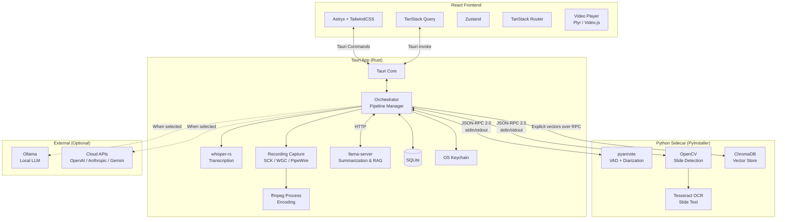
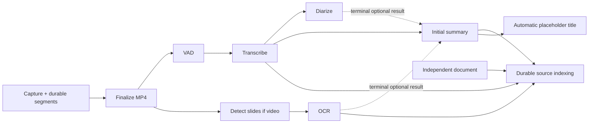
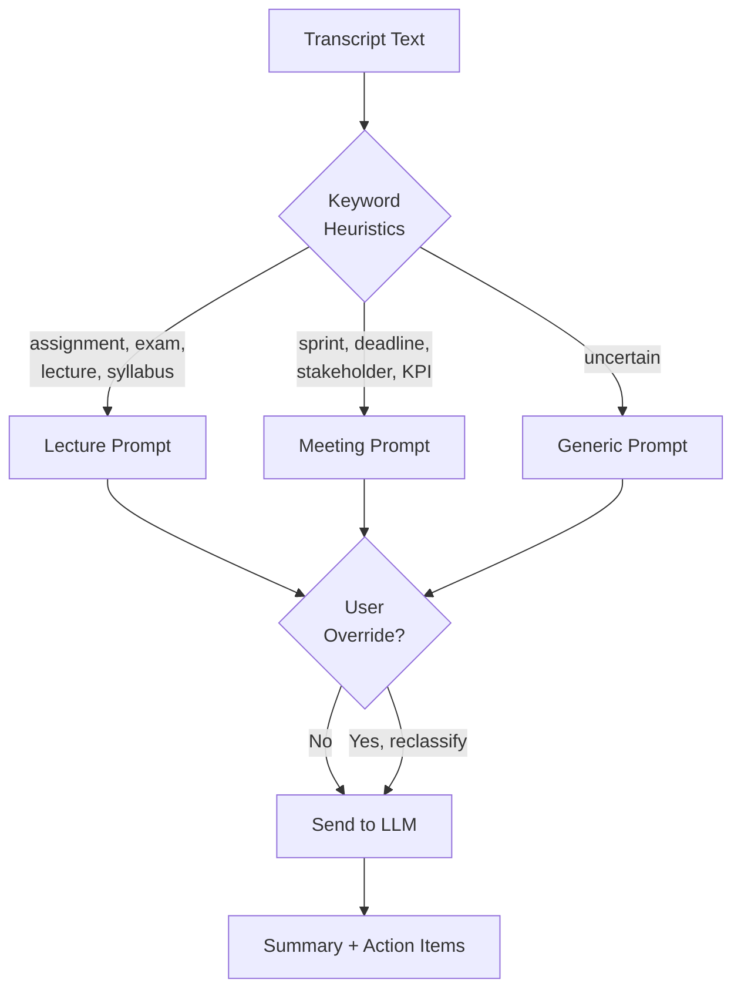

# Locus — Design Document

> **Offline-first, cross-platform meeting recording & summarization app**
> MIT for original Locus code; separate third-party code/model notices
>
> Version 1.1 · Reviewed 2026-09-05 · Architecture approved for implementation; feasibility gates are not completed features.
>
> Authority: [PRD](./PRD.md) defines product scope; [SPEC](./SPEC.md) defines behavior and acceptance; this document defines architecture. [IMPLEMENTATION](./IMPLEMENTATION.md) orders delivery. Use [CONTEXT](../../CONTEXT.md) for canonical terms.

---

## 1. Vision & Goals

Locus records meetings (online or in person), transcribes them with speaker diarization, extracts slide content, and generates context-aware summaries — all **locally by default**. Users can optionally connect cloud AI providers for higher-quality results, and all local processing runs on-device. Bundled capture, transcription, diarization and slides work on a disconnected first launch; generation/embedding models require skippable download or local import before those features work offline.

### Target Users
- **Knowledge workers** — office meetings, standups, 1:1s → action items, deadlines, decisions
- **Students** — classroom lectures, seminars → study notes, key concepts, assignments

Rust detects meeting type via keyword heuristics and selects the appropriate summarization prompt. Users can override the detected type at any time.

### Principles
1. **Offline-first**: Bundled processing works immediately offline; summarization/search work offline after model provisioning
2. **Resource-bounded**: Capture has priority; default Balanced scheduling bounds heavy workers and unloads idle models
3. **Privacy-respecting**: Content leaves the machine only for a disclosed request to an explicitly selected remote provider, including remote Ollama
4. **Cross-platform**: macOS + Windows + Linux (v1)

---

## 2. Architecture Overview



### Key Boundaries

| Layer | Responsibility | Language |
|-------|---------------|----------|
| **Tauri Core** | Windowing, system tray, file dialogs, auto-update, recording capture, transcription (whisper-rs), embedding generation (via HTTP to llama-server), orchestration, database, keychain | Rust |
| **React Frontend** | UI rendering, user interactions, video playback, state management | TypeScript |
| **Python Sidecar** | VAD, diarization, slides/OCR and vector storage; Rust owns lifecycle, job ordering and publication | Python runtime qualified with the full packaged dependency set |
| **LLM Engine** | Summarization & Embeddings (llama-server subprocess) | N/A |

> [!IMPORTANT]
> **Python sidecar** — The sidecar handles ML workloads (pyannote VAD + diarization, OpenCV headless slide detection, Tesseract OCR) and vector storage (ChromaDB). It starts on-demand with warm-up and stays running while the app is open. Communication is JSON-RPC 2.0 over Tauri's sidecar stdin/stdout protocol.

---

## 3. Tech Stack

### Core

| Component | Technology | Notes |
|-----------|-----------|-------|
| Desktop shell | **Tauri 2.11** | Rust backend, webview frontend |
| Frontend framework | **React 19+** | With TypeScript |
| UI components | **Astryx** (Meta) | 150+ accessible components, StyleX internals |
| Styling overrides | **TailwindCSS** | Optional, for custom styling on top of Astryx |
| State (server) | **TanStack Query** | Async data from Tauri commands |
| State (client) | **Zustand** | Recording UI state, settings, local state |
| Routing | **TanStack Router** | Type-safe, integrates with TanStack Query |
| Video player | **Plyr** or **Video.js** | HTML5 `<video>` with transcript sync |

### Backend (Rust)

| Component | Technology | Notes |
|-----------|-----------|-------|
| Transcription | **whisper-rs** ([codeberg.org/tazz4843/whisper-rs](https://codeberg.org/tazz4843/whisper-rs)) | Rust bindings for whisper.cpp |
| Recording capture | **ScreenCaptureKit** + microphone path (macOS 13+); **Windows Graphics Capture** + **WASAPI** | Video, loopback audio and microphone adapters share one media clock |
| Recording capture (Linux) | **PipeWire** portal | Screen cast + audio capture for Wayland |
| Encoding | **ffmpeg** (bundled binary) | Spawned as subprocess by Rust |
| Embedding | **Llama.cpp** (via `llama-server`) | Separately provisioned GGUF model, vectors requested by Rust via local HTTP |
| Database | **SQLite** via `rusqlite` | Dedicated DB worker, explicit transactions/migrations, authoritative ownership and job visibility |
| Keychain | **keyring** crate | macOS Keychain, Windows Credential Manager, Linux Secret Service |
| Auto-update | **Tauri updater** | + manual download from GitHub Releases |

### Backend (Python Sidecar)

| Component | Technology | Notes |
|-----------|-----------|-------|
| Diarization | **pyannote-audio** | `pyannote/speaker-diarization-community-1` model bundled. Also provides VAD. |
| Slide detection | **OpenCV** (`opencv-python-headless`) | Headless build — no GUI dependencies, reduced size |
| OCR | **Tesseract** (`pytesseract`) | Text extraction from slide frames |
| Vector storage | **ChromaDB** | Embedded vector database for Knowledge Base, persists to disk |
| Packaging | **PyInstaller** | Standalone binary, no user-visible Python |

### LLM (Inference)

| Provider | Access | Notes |
|----------|--------|-------|
| **Llama.cpp** | `llama-server` subprocess | Primary local LLM, bundled binary, curated JSON Model Catalog |
| **Ollama** | Loopback by default; configurable endpoint | Explicitly selected alternative; non-loopback destinations are remote |
| **OpenAI** | API key | Cloud option |
| **Anthropic** | API key | Cloud option |
| **Gemini** | API key | Cloud option |

---

## 4. Processing Pipeline

Capture encodes continuously into recoverable segments; “Encode” below is finalization of saved media, not a promise to retain unbounded raw video until Stop.



Balanced is the default scheduler mode. Maximum permits qualified parallelism, but both prioritize recording and bound memory. Rust queues jobs durably, assigns resource leases, and suspends/defers heavy inference and indexing during capture. Model processes may remain alive without retaining all weights. A non-cooperative task is canceled and restarted from a safe checkpoint if needed to release capture resources.

| Job | Input → published output | Failure / inapplicable behavior |
|-----|--------------------------|--------------------------------|
| Capture/finalize | Selected source streams → recoverable manifest, media segments, final H.264/AAC MP4 | Stop on storage/source/permission loss or forced sleep; preserve committed segments and offer recovery |
| VAD | Mixed audio → original-timeline speech intervals | Error falls back to bounded sequential chunks; empty speech is a valid result |
| Transcribe | VAD-guided chunks → timestamped transcript revision | Error offers retry; no speech skips speech-derived generation |
| Diarize | Source audio + transcript → speaker alignment revision | Keep undiarized transcript and mark missing/uncertain speaker evidence |
| Slides | Video → unique images and transition occurrences | No video skips; failure preserves other work |
| OCR | Slide images → text with slide references | No slides skips; failed images remain viewable |
| Initial summary | Usable transcript plus terminal optional inputs → structured summary revision/actions/citations | Missing model blocks only generation; errors preserve prior results; never silently substitute slides-only summary |
| Index source | Each available source revision → model-versioned chunks/vectors | Durable blocked/error/retry state visible at source level; independent of summary |
| Title | Whole-session summary, or bounded transcript passages spanning session → concise title | Publish only against unchanged placeholder revision; otherwise discard; absent model preserves placeholder |

Persist job states pending/running/done/error/blocked/skipped/canceled with reason codes. Artifact freshness (current/outdated) is separate from attempt state: an error does not erase a previous successful output. Every event/result is correlated by request, job and attempt IDs and guarded by source revision plus cancellation/deletion generation. Retrying does not repeat unaffected upstream work; it marks affected descendants outdated, rebuilds derived indexes, and requires an explicit action to replace an existing summary.

### Capture lifecycle and storage

- One active capture is owned by Rust across route changes and window closure. Close-to-background retains discoverable system controls; explicit quit offers Stop and save or Cancel. If a supported desktop lacks a tray surface, retain a compact recording-control window.
- Preflight permissions, selected sources, disk access/headroom and encoder readiness. Preserve source audio tracks and a default mixed playback track; separate sources are not merely stereo channels. Audio-only MP4 carries no video.
- A common monotonic media clock drives source synchronization, finalization, VAD offsets, transcription, slides and citations. Pause time is removed. Drift/resampling and discontinuities are explicit adapter responsibilities.
- Write independently decodable segments and checkpoint a durable manifest frequently enough to meet the tested ≤5-second process-crash tail-loss target. Completed segments remain recoverable if finalization fails. Recovery tests establish fsync/storage assumptions; sudden disk failure is not covered by an absolute zero-loss claim.
- Three hours is a validation target and warning threshold, not a stop limit. Forced sleep/source loss stops capture; reopening/recovery never silently starts it again.

### Transcription Configuration

- **Default model**: `small` (bundled, 466 MiB)
- **Downloadable models**: `tiny`, `base`, `medium`, `large-v3` via in-app model manager
- **Quantized models**: Verified compatible q5_0, q5_1, q8_0 variants where supported, alongside standard weights with measured sizes. Standard small remains the default.
- **Language**: Auto-detect by default, manual override available
- **GPU acceleration candidates** (qualification before runtime selection):

| Platform | GPU | Backend |
|----------|-----|---------|
| macOS Apple Silicon | Apple GPU | Metal; CoreML only after assets/build qualification |
| macOS Intel + AMD | AMD GPU | Evaluate Metal and Vulkan/MoltenVK independently; CPU baseline |
| macOS Intel (no GPU) | — | CPU |
| Windows / Linux | NVIDIA | CUDA |
| Windows / Linux | AMD | ROCm / HIP |
| Windows / Linux (no GPU) | — | CPU |

#### VAD-Guided Chunking

- **VAD engine**: pyannote VAD in the Python sidecar, running on the mixed audio track (system + mic combined)
- **Chunk strategy**: VAD identifies speech regions. Contiguous speech regions are grouped into chunks with a 5-minute maximum. If a speech region exceeds 5 minutes (e.g., continuous lecture), it is split at the lowest-energy point within the region.
- **Timestamp alignment**: Chunk timestamps are aligned to the original recording timeline. Whisper processes each chunk independently; results are merged with correct offsets.
- **Designed for 3-hour recordings**: Bound memory and test continuity, offsets and overlap/deduplication on continuous-speech and silence-bearing fixtures. Accuracy and speed are measured targets, not guaranteed by chunking alone.

#### Audio Track Routing

- **VAD**: Runs on the mixed audio track (both system + mic combined)
- **Transcription**: Runs on the mixed audio track (captures everything said by all parties)
- **Diarization**: Diarize both source streams by default, retaining provenance. An explicit “Only me on this microphone” setting may assign mic speech to User. In-person microphone capture can contain multiple speakers. Handle overlapping speech, echo and ambiguous mixed-transcript alignment without inventing speaker identity; keep user renames attached to stable references.

### Prompt Routing



- **Keyword heuristics** detect meeting type automatically (zero LLM cost)
- **User override** changes the selected type and offers explicit regeneration when a summary already exists; retain prior revisions and checked items.
- **Prompt templates** are versioned application assets. User-editable templates are deferred to v3.
- **Long-input generation** uses bounded hierarchical passes covering the session, with source provenance carried forward. Validate structured sections, optional assignees/deadlines and citations before publication; never silently truncate the transcript.
- **Titles** start as date/time placeholders and prefer the completed whole-session summary as context. A bounded selection spanning the transcript is the fallback when generation remains available. Compare title origin/revision at commit so a late response cannot overwrite a user rename.
- **Providers** are snapshotted per job. Configured credentials do not authorize sending content until the user explicitly selects that provider with destination/context disclosure; no silent remote failover.

---

## 5. Data Model and Integrity

This is the schema contract, not a ready-to-run SQL migration. Implement checked-in migrations in the foundation task and verify constraints with real SQLite. Use UUID identifiers, UTC instants plus the meeting's IANA timezone for date interpretation, media-relative fractional seconds for timestamps, and app-owned relative file paths.

SQLite via rusqlite owns product truth; ChromaDB holds rebuildable vector data. Enable foreign keys on every connection, serialize DB writes through a worker, use explicit transactions and validate cross-meeting references. Capture/audio/frame IO never blocks on the UI thread.

| Entity | Required fields and relationships |
|--------|-----------------------------------|
| meetings | id, title, title_origin (placeholder/automatic/user), title_revision, recorded_at, timezone, duration, requested_type (auto/meeting/lecture), detected_type (meeting/lecture/generic), language selection/detection, capture_sources, single-person-mic option, lifecycle, deletion_generation/deleted_at, current source pointers |
| capture_manifests / media_segments | meeting_id, capture generation, stream/source IDs, media clock offsets, ordered segment paths, committed durations/checksums, recovery/finalization state; final playback and preserved-source artifacts |
| jobs / job_attempts | meeting_id or document_id, kind, source revision/config snapshot, resource class, state/reason, unique attempt_id, progress, cancellation generation, started/completed timestamps, structured redacted error; one current attempt per logical job |
| artifact_revisions | owner/source, kind, immutable revision, input revision set, model/prompt/config identity, artifact location, current/outdated state, publication timestamp; previous success survives failed replacement |
| transcript_segments | transcript_revision_id, meeting_id, ordered start/end/text, detected language/confidence, source provenance; checked nonnegative and non-reversed media times |
| speakers / speaker_alignments | meeting-scoped stable speaker ID, anonymous label, optional custom name/color; alignment revision maps transcript/time spans to zero/one/multiple speaker IDs with uncertainty/source |
| slides / slide_occurrences | immutable image artifact/hash and OCR source revision; each occurrence retains meeting timestamp and ordinal, allowing one unique slide image to appear at multiple times |
| summary_revisions | meeting_id, immutable revision, type including generic, structured sections and speaker references, rendered Markdown projection, input revision set, model/prompt identity, current/outdated status; explicit current pointer |
| action_items / action_state | summary_revision_id, extracted text, optional speaker assignee reference, original deadline phrase plus optional normalized deadline, evidence refs; stable item ID owns user completion state, preserved with its revision |
| documents / document_meetings | independent document ID, content hash (unique), managed original path, type/size/page count, extraction state/version; unique document_id + meeting_id links |
| sources / source_chunks | authoritative owner, kind, artifact revision, visibility, chunker version, text and location (media time/page/text offsets), stable chunk IDs; links do not duplicate document chunks |
| index_generations / index_jobs | embedding model ID/revision/dimension + chunker version; source revision, readiness/error/progress, durable attempts; never mix incompatible vector spaces |
| chat_threads / chat_messages | fixed scope kind and optional meeting_id per thread; ordered user/assistant turns, provider/model snapshot, completion/error/cancel state and prompt-context dependencies |
| citations / message_dependencies | message or generated-claim ID → source revision/chunk and location; dependency links to prior turns and sources support validated references and transitive deletion |
| model_assets / downloads | catalog ID, exact artifact revision/hash/format/role, bundled/imported/downloaded origin, managed relative location, verified/readiness state, resumable download metadata and current-use leases |
| storage_migrations / cleanup_jobs | source/target app-owned roots, manifest, verification/progress, atomic-switch state, durable retry/error; deletion tombstones fence visibility before cleanup |
| settings | non-secret configuration and schema version; keys stay in OS credential storage |

### Publication and retry

Write new artifacts into attempt-specific managed paths, verify them, then atomically publish DB pointers only if the input/deletion generations still match. Keep the prior successful revision visible until replacement commits. Clean up abandoned attempts through durable reconciliation. Stable speaker references update rendered names without global text replacement; immutable source quotes remain intact.

Summary regeneration creates a revision with distinct generated items; retain old checked-item state with the old revision. Do not automatically map completion using similar text alone. Index replacement depends on source revision and embedding generation, not summary success.

### Retrieval and deletion

Store explicit embeddings in ChromaDB collections per compatible index generation, with deterministic chunk IDs and owner/revision metadata. Rust filters source eligibility from SQLite before retrieval and validates returned metadata before prompting. A model switch builds a new generation and switches atomically when ready; retain a working old generation while possible.

A deletion transaction creates a visibility tombstone, increments the owner's generation, fences jobs and queues cleanup. New queries/exports exclude it immediately; late responses fail publication. Remove vectors, owned media/intermediates, citations, scoped threads and affected mixed-chat messages plus dependent turns/context. Independent documents survive meeting deletion with their links removed. Retry incomplete physical cleanup on restart and reconcile orphans. Local deletion cannot recall previously exported files or remote requests already sent.

### Model and meeting storage

Bundled standard Whisper small stays inside the application bundle. Managed downloads/imported copies default to app data under a separately configurable models root. Migration waits for affected models/downloads to be idle, preflights space and permissions, copies/checksums managed assets, atomically switches metadata, and only then offers old-copy cleanup. Preserve original paths/configuration on failure; missing drives show models unavailable without automatic duplicate downloads. Original user-imported files are never owned by cleanup.

Meeting-data relocation separately coordinates SQLite, ChromaDB and media with data-changing workers idle. Use a migration journal and recover before opening writable stores. Never move live database files independently or treat unrelated files in a configured folder as app-owned.

### Chat and provider boundaries

Persist scope per thread; a scope change starts a new thread without copying its history. One-meeting scope includes linked documents, all-meetings excludes standalone documents, documents-only excludes meeting results, and everything includes both. Every response stores validated citation and context dependencies. Model/provider selection may change per turn, with the destination visible before dispatch.

Managed llama-server instances bind loopback only, use per-launch credentials and are owned/reaped by Rust. Generation and embedding roles have explicit health checks, model identity and resource leases; a single process is not assumed to serve incompatible models simultaneously. Sidecar starts lazily, persists ChromaDB locally and may unload heavy models while remaining alive. Dependency telemetry/network defaults must be disabled for offline paths.

---

## 6. Frontend Architecture

### Views (Progressive Rollout)

> **Layout convention**: Locus follows the sidebar-driven layout common to LLM desktop apps. A persistent left sidebar provides top-level navigation. Views fill the main content area to the right of the sidebar. A downloads indicator in the sidebar footer shows background model download progress.

**v1 — Core (5 sidebar items + Meeting Detail):**

| View | Route | Sidebar Item | Description |
|------|-------|-------------|-------------|
| Recording | `/record` | ✅ Recording | Capture source toggles, meeting type, record button |
| Meetings | `/` | ✅ Meetings | Search, filter, browse past recordings |
| Meeting Detail | `/meeting/:id` | — (sub-view of Meetings) | Video player + transcript + summary + slides (tabbed) |
| Knowledge Base | `/knowledge` | ✅ Knowledge Base | Chat-first interface: conversation list in a secondary sidebar, LLM model selector in the chat input area, semantic search, document upload. Inspired by LLM chat platforms but not a 1:1 copy. |
| Model Manager | `/models` | ✅ Model Manager | Unified hub for all model types: Whisper transcription models, LLM summarization models, and embedding models. Curated catalog (JSON) with download/delete/select actions. |
| Settings | `/settings` | ✅ Settings | 3-column layout: global sidebar → settings category nav → content panel. Categories: General, Appearance, Recording Defaults, LLM Providers (Local: Llama.cpp; Remote: OpenAI, Anthropic, Gemini), Storage, Privacy. |

**v2 — Real-time + Polish:**

Also planned: image context for standalone images and document-embedded images, including OCR and visual understanding of charts/diagrams/screenshots with image/page citations. Detailed formats/model budgets belong in the v2 specification.

| View | Route | Description |
|------|-------|-------------|
| Dashboard | `/dashboard` | Stats, recent meetings, upcoming deadlines |
| Calendar | `/calendar` | Timeline view of meetings |

**v3 — Advanced:**

| View | Route | Description |
|------|-------|-------------|
| Prompt Editor | `/settings/prompts` | Custom summarization prompt templates |

### Frontend ownership and required states

Gemini 3.8 Flash High owns all frontend work, including interaction design, React/TypeScript, styling, frontend wrappers, accessibility and frontend tests, using the impeccable skill. Backend owners supply versioned DTOs, commands/events and deterministic fixtures before UI integration. Rust owns capture/job truth; Zustand holds presentation state and queries resynchronize when a window reopens.

Design unobtrusive but persistent states for missing models, offline setup, source permissions, recording interruption/recovery, unavailable slides/summary, outdated revisions, indexing errors, storage relocation, deleted sources, incomplete streamed answers and fixed-scope thread creation. Preserve keyboard access and show source/destination identity without exposing implementation details. Critical interaction tests are required in v1; broad visual snapshots are deferred. Screenshots in docs/screenshots are reference material, not independent product authority.

### Component Stack

```
React 19 + TypeScript
├── TanStack Router          (type-safe routing)
├── TanStack Query           (server state from Tauri commands)
├── Zustand                  (client state: recording, UI)
├── Astryx                   (150+ components)
│   └── TailwindCSS          (style overrides)
└── Plyr / Video.js          (video playback + transcript sync)
```

### Key Interaction: Transcript ↔ Video Sync

```tsx
// Click transcript line → video seeks to timestamp
<TranscriptLine
  isActive={isInRange(currentTime, seg.start, seg.end)}
  onClick={() => playerRef.current.seekTo(seg.start)}
/>

// Video time update → highlights active transcript line
<VideoPlayer onTimeUpdate={(t) => setCurrentTime(t)} />
```

### Export Formats

- **Clipboard copy** — one-click copy summary to clipboard (Slack/email paste)
- **Markdown** — `.md` file with full transcript + summary
- **PDF** — formatted document for sharing
- **JSON** — programmatic access, integrations

---

## 7. Monorepo Structure

```
locus/
├── src-tauri/                    # Rust backend
│   ├── src/
│   │   ├── main.rs               # Tauri entry point
│   │   ├── commands/             # Tauri command handlers (frontend API)
│   │   │   ├── mod.rs
│   │   │   ├── recording.rs      # start/stop/pause recording
│   │   │   ├── meetings.rs       # CRUD meetings
│   │   │   ├── transcription.rs  # trigger/status transcription
│   │   │   ├── summarization.rs  # trigger/status summarization
│   │   │   ├── models.rs         # model manager (download/list/select)
│   │   │   ├── knowledge.rs      # KB upload, search, chat
│   │   │   ├── settings.rs       # app settings
│   │   │   └── export.rs         # export to MD/PDF/JSON
│   │   ├── capture/              # Recording capture
│   │   │   ├── mod.rs
│   │   │   ├── macos.rs          # ScreenCaptureKit
│   │   │   ├── windows.rs        # Windows Graphics Capture
│   │   │   ├── linux.rs          # PipeWire portal
│   │   │   └── encoder.rs        # ffmpeg process management
│   │   ├── transcription/        # whisper-rs integration
│   │   │   ├── mod.rs
│   │   │   ├── engine.rs         # whisper-rs wrapper, backend detection
│   │   │   └── models.rs         # model download, storage, selection
│   │   ├── pipeline/             # Processing orchestrator
│   │   │   ├── mod.rs
│   │   │   ├── orchestrator.rs   # step sequencing, status tracking
│   │   │   └── steps.rs          # individual step definitions
│   │   ├── sidecar/              # Python sidecar management
│   │   │   ├── mod.rs
│   │   │   ├── protocol.rs       # JSON-RPC 2.0 codec
│   │   │   └── client.rs         # typed RPC client
│   │   ├── llm/                  # LLM integration
│   │   │   ├── mod.rs
│   │   │   ├── llama_cpp.rs      # Llama.cpp HTTP client (llama-server)
│   │   │   ├── ollama.rs         # Ollama fallback client
│   │   │   ├── openai.rs         # OpenAI API client
│   │   │   ├── anthropic.rs      # Anthropic API client
│   │   │   ├── gemini.rs         # Gemini API client
│   │   │   └── prompts.rs        # prompt templates + routing logic
│   │   ├── knowledge/            # Knowledge Base
│   │   │   ├── mod.rs
│   │   │   ├── embeddings.rs     # API client for embedding generation
│   │   │   ├── documents.rs      # document upload, chunking, text extraction
│   │   │   └── search.rs         # semantic search, chat RAG pipeline
│   │   ├── db/                   # Database layer
│   │   │   ├── mod.rs
│   │   │   ├── migrations/       # SQL migration files
│   │   │   ├── meetings.rs       # meeting queries
│   │   │   ├── transcripts.rs    # transcript queries
│   │   │   └── settings.rs       # settings queries
│   │   ├── models/               # Verified assets/downloads/migration and process leases
│   │   ├── storage/              # Root resolution, durable deletion/recovery/migration
│   │   └── keychain.rs           # OS keychain wrapper
│   ├── Cargo.toml
│   ├── tauri.conf.json
│   └── build.rs                  # whisper-rs feature flags, ffmpeg bundling
│
├── src/                          # React frontend
│   ├── main.tsx                  # App entry
│   ├── routes/                   # TanStack Router file-based routes
│   │   ├── __root.tsx            # Root layout (persistent sidebar + downloads indicator)
│   │   ├── index.tsx             # Meetings list (default landing)
│   │   ├── record.tsx            # Recording view
│   │   ├── meeting.$id.tsx       # Meeting detail (sub-view of Meetings)
│   │   ├── knowledge.tsx         # Knowledge Base (chat-first, secondary sidebar for threads)
│   │   ├── models.tsx            # Model Manager (whisper + LLM + embedding)
│   │   └── settings.tsx          # Settings (3-column layout)
│   ├── components/               # Shared React components
│   │   ├── layout/               # AppShell, Sidebar, DownloadsIndicator
│   │   ├── meetings/             # MeetingCard, MeetingGrid, MeetingMeta
│   │   ├── recording/            # RecordButton, CaptureToggles, AudioWaveform
│   │   ├── player/               # VideoPlayer, TranscriptSync, SlideGallery
│   │   ├── summary/              # SummaryView, ActionItems, DecisionList
│   │   ├── knowledge/            # ChatPanel, ThreadList, SearchBar, DocumentUpload
│   │   ├── models/               # ModelCatalog, ModelCard, DownloadProgress
│   │   └── settings/             # SettingsNav, ProviderConfig, StorageInfo
│   ├── hooks/                    # Custom React hooks
│   │   ├── use-recording.ts      # capture state queries/commands; Rust owns lifecycle
│   │   ├── use-pipeline-status.ts # polling pipeline step statuses
│   │   └── use-transcript-sync.ts # video ↔ transcript sync
│   ├── stores/                   # Zustand stores
│   │   ├── recording-store.ts
│   │   └── ui-store.ts
│   ├── lib/                      # Utilities
│   │   ├── tauri.ts              # typed Tauri command wrappers
│   │   ├── format.ts             # duration, timestamp, date formatting
│   │   └── export.ts             # UI actions for backend export commands
│   └── styles/                   # Global styles, Tailwind config
│
├── sidecar/                      # Python sidecar
│   ├── src/
│   │   ├── main.py               # Entry point, JSON-RPC server loop
│   │   ├── rpc/                   # JSON-RPC protocol handling
│   │   │   ├── __init__.py
│   │   │   ├── server.py         # stdin/stdout JSON-RPC server
│   │   │   └── methods.py        # registered RPC methods
│   │   ├── diarization/          # pyannote integration
│   │   │   ├── __init__.py
│   │   │   ├── engine.py         # diarize(audio_path) → speaker segments
│   │   │   └── vad.py            # VAD: detect speech regions
│   │   ├── slides/               # Slide extraction pipeline
│   │   │   ├── __init__.py
│   │   │   ├── detector.py       # OpenCV frame differencing
│   │   │   └── ocr.py            # Tesseract text extraction
│   │   ├── vectordb/             # ChromaDB integration
│   │   │   ├── __init__.py
│   │   │   └── store.py          # ChromaDB storage and query
│   │   └── utils/
│   │       └── audio.py          # audio preprocessing utilities
│   ├── models/                   # Bundled ML models
│   │   └── pyannote/             # speaker-diarization-community-1
│   ├── requirements.txt
│   ├── pyproject.toml
│   └── build.spec                # PyInstaller spec file
│
├── models/                       # Bundled whisper model(s)
│   ├── ggml-small.bin            # 466 MiB, default model
│   └── README.md               # Bundled-asset revisions/notices; generation/embedding weights live in managed app data
│
├── docs/                         # Documentation
│   ├── plans/                    # PRD.md, SPEC.md, DESIGN.md, IMPLEMENTATION.md
│   └── adr/                      # Rationale for costly decisions
│
├── tests/                        # Integration tests
│   ├── fixtures/                 # Sample audio/video files
│   ├── test_pipeline.rs          # End-to-end pipeline tests
│   └── test_transcription.rs     # Whisper-rs accuracy tests
│
├── .github/
│   └── workflows/                # CI/CD
│       ├── build-macos.yml
│       ├── build-windows.yml
│       ├── build-linux.yml
│       └── test.yml
│
├── package.json                  # Frontend dependencies
├── tsconfig.json
├── tailwind.config.ts
├── vite.config.ts
├── AGENTS.md                    # Contributor/agent rules and verification gates
├── CONTEXT.md                   # Product glossary
└── README.md
```

> [!TIP]
> **Clean code principles enforced by structure:**
> - Each Rust module has a single responsibility (`capture/`, `transcription/`, `pipeline/`, `sidecar/`, `llm/`, `db/`)
> - Commands layer (`commands/`) is thin — it delegates to domain modules
> - Frontend mirrors this: `components/` by feature domain, `hooks/` for stateful logic, `stores/` for global state, `lib/` for pure utilities
> - Python sidecar has its own clean structure: `rpc/` for protocol, feature modules for ML workloads

---

## 8. Communication Protocol

### Rust ↔ frontend

Backend owners define the versioned DTOs and command/event schema first; Gemini implements the TypeScript wrappers and UI consumers against generated types/fixtures. Use opaque IDs, validated enums and structured errors (code, recoverability, safe message); never expose credentials, arbitrary filesystem access or unrestricted subprocess commands through the frontend.

| Commands / queries | Contract essentials |
|--------------------|---------------------|
| start/pause/resume/stop/recover recording | Idempotent intent + capture ID/expected generation; return authoritative state immediately, job IDs for asynchronous work |
| list/get/update/delete meeting | Pagination/filter; title origin/revision; delete tombstone and cleanup state, not a promise of instant physical deletion |
| pipeline status/retry/cancel | Logical job ID and attempt; source/config snapshot; rejected stale intent and preserved prior result |
| transcript/speakers/slides/summary/actions | Revision-aware results; explicit unknown/unavailable/outdated state and stable speaker/action references |
| models/download/import/select/delete/migrate | Catalog roles and exact artifacts, validation/progress, selected versus merely installed, leases and destination state |
| sources/upload/link/index/retry | Deduplicated source identity, extraction/index status, source revisions and safe document locations |
| threads/create/send/cancel/search | Fixed scope, explicitly selected provider/model, stream request ID, citations, incomplete/error states |
| settings/provider/update/storage | Redacted credentials, destination disclosure, migration/update idle checks |
| export/copy | Chosen current or explicitly selected older revision; safe Markdown/PDF/JSON/clipboard rendering with provenance and no hidden network fetches |

Expose events for capture/job/download/chat changes with owner ID, attempt/generation and monotonically ordered sequence. Queries provide durable snapshots; reconnect/refocus resynchronizes through queries rather than trusting missed events. Coalesce high-frequency progress. Backend validation is mandatory even when UI disables an invalid action.

### Rust ↔ Python (JSON-RPC 2.0)

Use newline-delimited UTF-8 JSON over owned stdin/stdout, with bounded frame size, strict schemas and a startup version/capability handshake. Stdout is protocol-only; redact logs on stderr. Requests identify job/attempt and exact inputs; notifications include those identifiers for progress/cancellation correlation.

```json
{"jsonrpc":"2.0","method":"diarize","params":{"job_id":"job-1","attempt_id":"attempt-2","audio_path":"/managed/meeting/source.wav","single_person":false},"id":"rpc-7"}
{"jsonrpc":"2.0","method":"progress","params":{"job_id":"job-1","attempt_id":"attempt-2","fraction":0.45}}
{"jsonrpc":"2.0","result":{"segments":[{"start":0.5,"end":4.2,"speaker":"SPEAKER_00"}]},"id":"rpc-7"}
```

Required methods cover handshake/health, VAD, diarization, slide detection/OCR, explicit vector upsert/query/delete and cancel. Only Rust-resolved managed paths may cross the boundary; validate canonical containment, symlinks and owner IDs. A Python “success” is unpublished data until Rust verifies current ownership/revision and commits it.

The Rust client enforces request IDs, typed results, deadlines, frame limits, bounded queues and subprocess ownership. A sidecar crash fails affected attempts, restarts safely, and reopens persistent vector state; retry is controlled by Rust. Test malformed frames, wrong/out-of-order IDs, duplicate/delayed results, cancellation, unknown methods, process exit and stdout contamination.

---

## 9. Build & Distribution

### Feasibility before promises

Target Tauri 2.x (existing plan target 2.11), React 19, Astryx and the named Rust/Python dependencies; pin a mutually compatible tested set in lockfiles during foundation. Astryx uses its official scoped package/CLI; do not substitute an unrelated package by guessing its name. Select a Python runtime from demonstrated compatibility, not a version-only preference.

Backend detection selects only packaged, validated implementations and always has a tested CPU inference baseline. Enabling several Cargo features is not proof of runtime switching or a universal artifact. Evaluate dynamic backends versus explicit artifact variants early, including missing drivers and initialization failure.

Intel/AMD llama.cpp PR #19527 concerns native Metal correctness/performance; it does not implement MoltenVK. Evaluate those paths separately, pin a custom fork only if required by measured results, and record its commit/build recipe/checksum. Prebuilt sidecars/engines must be reproducible and tied to reviewed source; no floating release URLs.

### Target artifacts and qualification

| Platform | Target delivery | Required evidence |
|----------|-----------------|-------------------|
| macOS 13+ Apple Silicon + Intel | DMG and Homebrew cask; universal artifact only if all native dependencies qualify | Both architectures, capture audio/video/mic, clean offline install, signed/notarized complete app and nested binaries, upgrade |
| Linux x64 with PipeWire audio + functioning screen portal | AppImage and Flatpak | Target distro/desktop capability, codec/webview playback, portal permissions, Secret Service, discoverable recording controls, sandbox packaging and package-native update flow |
| Windows 10 1903+ x64 target | Installer; GPU-specific variants only where qualified | WGC + WASAPI, clean system/driver fallback, signing, bundled dependencies, upgrade, selected encoder/backend compatibility |

All three platforms are required for v1.0. Build the full feature set on macOS first, then port Linux and Windows, but run cross-platform feasibility checks before committing to deep platform-dependent work. Ordinary development artifacts support testing; maintain one stable release channel and no public alpha/beta channel.

### Packaging and release gates

- Include all required FFmpeg, Whisper small, pyannote, Tesseract executable/language data, sidecar and llama-server assets for bundled offline features. Generation/embedding models are provisioned separately. No developer Python, caches, credentials or network access may be needed for bundled functionality.
- Saved media uses H.264/AAC MP4; internal PCM/resampling/mixing/decoded frames remain required. Verify hardware encoder paths and a distributable fallback before declaring a device supported.
- Original Locus code is MIT. Retain exact code/model versions, corresponding notices and build provenance; verify redistribution and any required source obligations for the packaged artifacts. A format name or MIT application license does not establish dependency compliance.
- Measure compressed installer and installed size separately; Whisper small is 466 MiB on disk. The previous ≤400 MB base estimate is withdrawn; the 4.5 GB full-footprint target is provisional and excludes separately downloaded models.
- PR CI covers formatting/linting/type checking/builds, deterministic CPU and sidecar tests, critical frontend flows, schema/contracts and document links. Nightly/manual heavyweight jobs exercise actual engines; hardware capture/GPU and three-hour benchmarks require recorded evidence.
- Configure a PR evidence template and repository required checks/review rules as implementation deliverables. AGENTS.md is guidance; remote branch protection requires maintainer configuration.
- Signed stable updates require explicit installation while capture and data-changing jobs are idle, with migration recovery. Respect package-manager-owned update flows; verified manual installation remains possible.

### Primary-source verification references

- [Apple system-audio API](https://developer.apple.com/documentation/screencapturekit/scstreamconfiguration/capturesaudio): local Apple SDK availability declaration confirms macOS 13.0 for capturesAudio.
- [Windows Graphics Capture](https://learn.microsoft.com/en-us/windows/apps/develop/media-authoring-processing/screen-capture) and [WASAPI loopback](https://learn.microsoft.com/en-us/windows/win32/coreaudio/loopback-recording): distinct video/system-audio paths.
- [whisper.cpp model table](https://github.com/ggml-org/whisper.cpp#memory-usage): standard small disk size.
- [Astryx official repository](https://github.com/facebook/astryx): component system and supported setup.
- [llama.cpp PR #19527](https://github.com/ggml-org/llama.cpp/pull/19527): AMD discrete-GPU Metal changes; recheck status and need when pinning.
- [FFmpeg build/license guidance](https://ffmpeg.org/legal.html): audit the actual enabled distribution components.

---

## 10. Feature Roadmap

### v1.0 — Core (MVP)

- [ ] Recording (system audio + mic as separate tracks + screen, user-selected)
- [ ] Continuous recoverable encoding and final H.264/AAC MP4 with preserved source streams
- [ ] Voice Activity Detection (pyannote VAD, mixed track)
- [ ] Transcription via whisper-rs (VAD-guided chunking, 5-min max, multi-backend GPU)
- [ ] Diarization via pyannote (source-aware, multi-speaker mic by default, explicit personal-mic option)
- [ ] Slide extraction (OpenCV headless) + OCR (Tesseract)
- [ ] AI summarization (Llama.cpp + cloud APIs)
- [ ] Keyword-based prompt routing + user override
- [ ] Knowledge Base (ChromaDB, provisioned local embeddings, independent durable indexing, text document upload, cited fixed-scope chat)
- [ ] Video playback with transcript sync
- [ ] Sidebar-driven layout: Recording, Meetings, Knowledge Base, Model Manager, Settings
- [ ] Unified Model Manager (Whisper + LLM + embedding models, curated catalog)
- [ ] Export: clipboard, Markdown, PDF, JSON
- [ ] Auto-language detection with manual override
- [ ] Granular pipeline status with per-step retry
- [ ] Configurable pipeline parallelism (Balanced / Maximum)
- [ ] macOS + Linux + Windows
- [ ] Validate three-hour recordings, capture priority, recovery and bounded long-input generation
- [ ] Model/storage migration, safe deletion, revision preservation and automatic titles
- [ ] Critical frontend/backend automated tests and per-platform release evidence

### v2.0 — Real-time + Polish

- [ ] Real-time transcription during recording
- [ ] Dashboard with stats and deadline tracking
- [ ] Calendar view
- [ ] Image context for standalone/document-embedded images, OCR and visual understanding with image/page citations

### v3.0 — Advanced

- [ ] Custom prompt template editor
- [ ] Speaker voice profiles (auto-identify returning speakers)
- [ ] Meeting scheduling integration
- [ ] Mobile companion app (view summaries)

---

## 11. Settled Decisions and Implementation Boundaries

| Area | Settled decision |
|------|------------------|
| Source authority | PRD product scope; SPEC observable behavior/acceptance; DESIGN architecture; implementation plan delivery; CONTEXT terminology |
| Scope | Business meetings and lectures, online or microphone-only/in-person; at least one audio source, optional video |
| Offline setup | Bundled processing immediately offline; skippable generation/embedding download or local import |
| Credentials/selection | Stored keys only make providers available; explicit destination selection authorizes disclosed content, no remote failover |
| Capture | Rust-owned lifecycle, persistent background controls, stop-and-preserve on interruptions, ≤5-second process-crash recovery target |
| Duration/resources | Three hours warns, no cutoff; pauses excluded; Balanced default, capture priority in all modes |
| Audio/speakers | Preserved source tracks and mixed playback/transcription; multi-speaker mic default, explicit personal-mic User option |
| Failure/retry | Terminal optional failure permits initial transcript-based summary; no-speech is explicit; retain success, invalidate descendants |
| Revisions/user edits | Explicit existing-summary regeneration, previous revisions and completion retained, stable speaker references |
| Knowledge Base | Independent durable source indexing, cited fixed-scope persistent threads, new thread on scope change |
| Deletion | Immediate exclusion and late-result fencing; cleanup owned content and dependent chat, preserve independent linked documents |
| Document ingestion | Text PDF/MD/TXT; 50 MiB and 500 PDF pages initially; exact-byte dedup; v2 image context |
| Model storage | Bundle small read-only; configurable managed app-data downloads with idle verified migration and missing-drive states |
| Media | H.264/AAC MP4 saved output; required internal decode/PCM/frame support; encoder qualification gate |
| Titles | Date/time placeholder → whole-session summary or spanning transcript context; conditional publish, user titles always win |
| Platforms | macOS 13+; planned Windows/Linux targets qualified early; macOS feature-complete → Linux → Windows |
| Release/license | One stable release, all platforms validated, no maintained public beta channel; original code MIT, separate third-party notices |
| Frontend | Gemini 3.8 Flash High + impeccable; Astryx/Tailwind, React, TanStack Query/Router, Zustand presentation state |
| Backend | Rust orchestration/rusqlite/whisper-rs; Python ML/ChromaDB sidecar; managed llama-server; selected Ollama/OpenAI/Anthropic/Gemini |
| Contributor gates | Requirement traceability, meaningful behavior/regression tests, enforced CI/review configuration and explicit manual evidence |
| Future | v2 real-time/dashboard/calendar/image context; v3 prompt editor, speaker profiles, integrations/mobile |

The original implementation questions (model location, media scope, automatic titles) are resolved in [SPEC](./SPEC.md#resolved-implementation-questions). Dependency compatibility, artifact recipes, GPU support, codec fallback and measured budgets remain runnable feasibility gates in [IMPLEMENTATION](./IMPLEMENTATION.md), not silently assumed facts. ADRs record the rationale for [revisions](../adr/0001-preserve-generated-revisions-and-user-work.md), [ownership/deletion](../adr/0002-source-ownership-and-deletion.md) and [setup/selection](../adr/0003-local-setup-and-explicit-provider-selection.md).
