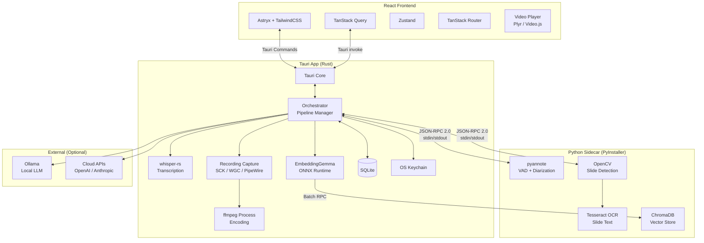
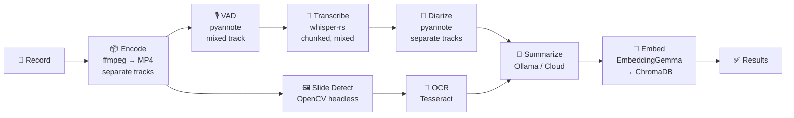
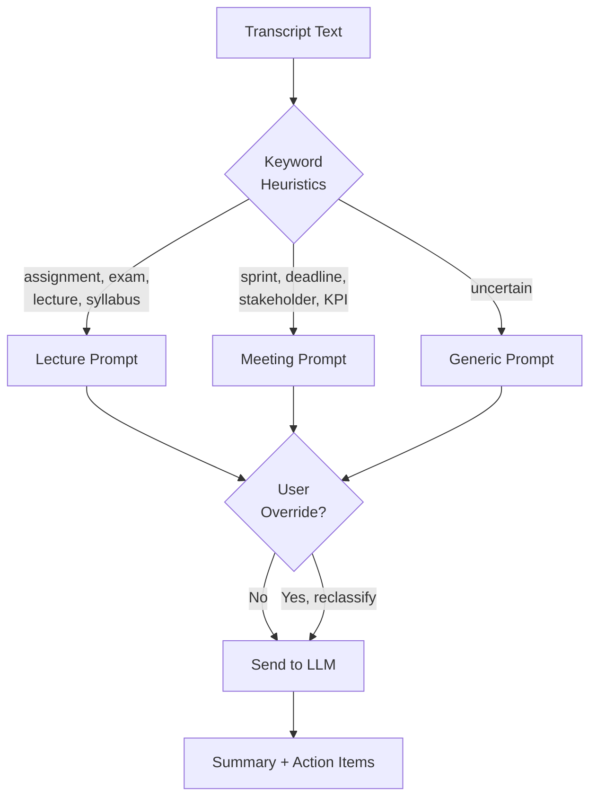

# Locus — Design Document

> **Offline-first, cross-platform meeting recording & summarization app**
> Open source (MIT / Apache 2.0)

---

## 1. Vision & Goals

Locus records meetings (online), transcribes them with speaker diarization, extracts slide content, and generates context-aware summaries — all **locally by default**. Users can optionally connect cloud AI providers for higher-quality results, but the core pipeline runs entirely on-device with no internet required.

### Target Users
- **Knowledge workers** — office meetings, standups, 1:1s → action items, deadlines, decisions
- **Students** — classroom lectures, seminars → study notes, key concepts, assignments

The LLM automatically detects meeting type via keyword heuristics and selects the appropriate summarization prompt. Users can override the detected type at any time.

### Principles
1. **Offline-first**: Recording, transcription, diarization, and summarization work without internet
2. **Lightweight**: Minimal resource overhead; no heavy server processes
3. **Privacy-respecting**: Data never leaves the machine unless the user explicitly chooses cloud APIs
4. **Cross-platform**: macOS + Windows + Linux (v1)

---

## 2. Architecture Overview



### Key Boundaries

| Layer | Responsibility | Language |
|-------|---------------|----------|
| **Tauri Core** | Windowing, system tray, file dialogs, auto-update, recording capture, transcription (whisper-rs), embedding generation (ONNX Runtime), orchestration, database, keychain | Rust |
| **React Frontend** | UI rendering, user interactions, video playback, state management | TypeScript |
| **Python Sidecar** | VAD (pyannote), Diarization (pyannote), slide detection (OpenCV headless), OCR (Tesseract), vector storage (ChromaDB) | Python 3.14 |
| **External Services** | LLM inference (Ollama or cloud APIs) | N/A |

> [!IMPORTANT]
> **Python sidecar** — The sidecar handles ML workloads (pyannote VAD + diarization, OpenCV headless slide detection, Tesseract OCR) and vector storage (ChromaDB). It starts on-demand with warm-up and stays running while the app is open. Communication is JSON-RPC 2.0 over Tauri's sidecar stdin/stdout protocol.

---

## 3. Tech Stack

### Core

| Component | Technology | Notes |
|-----------|-----------|-------|
| Desktop shell | **Tauri 2.11** | Rust backend, webview frontend |
| Frontend framework | **React 19+** | With TypeScript |
| UI components | **Astryx** (Meta) | 150+ accessible components, StyleX internals |
| Styling overrides | **TailwindCSS** | Optional, for custom styling on top of Astryx |
| State (server) | **TanStack Query** | Async data from Tauri commands |
| State (client) | **Zustand** | Recording UI state, settings, local state |
| Routing | **TanStack Router** | Type-safe, integrates with TanStack Query |
| Video player | **Plyr** or **Video.js** | HTML5 `<video>` with transcript sync |

### Backend (Rust)

| Component | Technology | Notes |
|-----------|-----------|-------|
| Transcription | **whisper-rs** ([codeberg.org/tazz4843/whisper-rs](https://codeberg.org/tazz4843/whisper-rs)) | Rust bindings for whisper.cpp |
| Recording capture | **ScreenCaptureKit** (macOS) / **Windows Graphics Capture** | Platform-specific, in Rust |
| Recording capture (Linux) | **PipeWire** portal | Screen cast + audio capture for Wayland |
| Encoding | **ffmpeg** (bundled binary) | Spawned as subprocess by Rust |
| Embedding | **EmbeddingGemma-300M** (via `ort` / ONNX Runtime) | Bundled model (~600MB), generates vectors in Rust |
| Database | **SQLite** (via `rusqlite` or `sqlx`) | Single-file, zero-config |
| Keychain | **keyring** crate | macOS Keychain, Windows Credential Manager, Linux Secret Service |
| Auto-update | **Tauri updater** | + manual download from GitHub Releases |

### Backend (Python Sidecar)

| Component | Technology | Notes |
|-----------|-----------|-------|
| Diarization | **pyannote-audio** | `pyannote/speaker-diarization-community-1` model bundled. Also provides VAD. |
| Slide detection | **OpenCV** (`opencv-python-headless`) | Headless build — no GUI dependencies, reduced size |
| OCR | **Tesseract** (`pytesseract`) | Text extraction from slide frames |
| Vector storage | **ChromaDB** | Embedded vector database for Knowledge Base, persists to disk |
| Packaging | **PyInstaller** | Standalone binary, no user-visible Python |

### LLM (External)

| Provider | Access | Notes |
|----------|--------|-------|
| **Ollama** | `http://localhost:11434` | Local LLM, user-installed, auto-detected |
| **OpenAI** | API key | Cloud option |
| **Anthropic** | API key | Cloud option |
| **Gemini** | API key | Cloud option |

---

## 4. Processing Pipeline



> **Pipeline parallelism** (configurable, default: parallel): After encoding, VAD and Slide Detection run concurrently. After VAD → Transcription, Diarization and OCR run concurrently. Summarization waits for both. Embedding runs as a silent background process after summarization with toast notifications. Users can switch to sequential mode ("Balanced") via settings for resource-constrained machines.

### Pipeline Steps (Sequential)

| Step | Runs In | Input | Output | Fallback on Failure |
|------|---------|-------|--------|-------------------|
| 1. **Record** | Rust | User triggers | Raw audio/video streams | — |
| 2. **Encode** | Rust → ffmpeg | Raw streams | MP4 file (H.264 + AAC) | Recording preserved as raw |
| 2.5. **VAD** | Python (pyannote) | Mixed audio track | Speech time ranges | Fallback to raw sequential transcription |
| 3. **Transcribe** | Rust (whisper-rs) | VAD-guided chunks (5-min max), mixed audio | Timestamped text segments | Error state, retry available |
| 4. **Diarize** | Python (pyannote) | Audio + segments | Speaker-labeled segments | Undiarized transcript preserved |
| 5. **Slide Detect** | Python (OpenCV) | Video from MP4 | Slide frames + timestamps | No slides, rest continues |
| 6. **OCR** | Python (Tesseract) | Slide frames | Extracted text per slide | Slides without text |
| 7. **Summarize** | Rust → Ollama/API | Transcript + slide text | Summary, action items, deadlines | Manual summary, transcript available |
| 8. **Embed** (background) | Rust (ONNX) → Python (ChromaDB) | Transcript + summary + documents | Vector embeddings in ChromaDB | Silent retry, toast notification |

> [!NOTE]
> **Granular per-step status**: Each step has its own status (pending → running → done → error). If step 4 (diarize) fails, the user still gets the undiarized transcript from step 3 and can view/export it. Each failed step is independently retriable. Embedding runs as a silent background process with toast notifications — it is not shown as a formal pipeline step in the UI.

### Transcription Configuration

- **Default model**: `small` (bundled, ~250MB)
- **Downloadable models**: `tiny`, `base`, `medium`, `large-v3` via in-app model manager
- **Quantized models**: q5_0, q5_1, q8_0 variants available in the model manager alongside standard weights. Standard weights are the default.
- **Language**: Auto-detect by default, manual override available
- **GPU acceleration** (runtime detection):

| Platform | GPU | Backend |
|----------|-----|---------|
| macOS Apple Silicon | Apple GPU | Metal + CoreML |
| macOS Intel + AMD | AMD GPU | Vulkan + MoltenVK |
| macOS Intel (no GPU) | — | CPU |
| Windows / Linux | NVIDIA | CUDA |
| Windows / Linux | AMD | ROCm / HIP |
| Windows / Linux (no GPU) | — | CPU |

#### VAD-Guided Chunking

- **VAD engine**: pyannote VAD in the Python sidecar, running on the mixed audio track (system + mic combined)
- **Chunk strategy**: VAD identifies speech regions. Contiguous speech regions are grouped into chunks with a 5-minute maximum. If a speech region exceeds 5 minutes (e.g., continuous lecture), it is split at the lowest-energy point within the region.
- **Timestamp alignment**: Chunk timestamps are aligned to the original recording timeline. Whisper processes each chunk independently; results are merged with correct offsets.
- **Designed for 3-hour recordings**: The chunking strategy keeps memory bounded and ensures no accuracy degradation on long recordings.

#### Audio Track Routing

- **VAD**: Runs on the mixed audio track (both system + mic combined)
- **Transcription**: Runs on the mixed audio track (captures everything said by all parties)
- **Diarization**: Receives separate audio tracks. The mic track is auto-assigned as "User" (known single speaker). The system audio track goes through pyannote's full speaker identification pipeline for remote participants.

### Prompt Routing



- **Keyword heuristics** detect meeting type automatically (zero LLM cost)
- **User override** is always available — changes the type and re-runs summarization with the correct prompt
- **Prompt templates** are stored as editable templates in the app (power users can customize)

---

## 5. Data Model (SQLite)

```sql
-- Core tables for v1

CREATE TABLE meetings (
    id              TEXT PRIMARY KEY,        -- UUID
    title           TEXT NOT NULL,
    recorded_at     TEXT NOT NULL,            -- ISO 8601
    duration_secs   INTEGER,
    meeting_type    TEXT DEFAULT 'auto',      -- 'meeting' | 'lecture' | 'auto'
    detected_type   TEXT,                     -- auto-detected type
    language        TEXT,                     -- detected/specified language
    video_path      TEXT,                     -- path to MP4 file
    audio_path      TEXT,                     -- path to audio-only file (if no video)
    capture_sources TEXT,                     -- JSON: ["system_audio", "microphone", "screen"]
    created_at      TEXT NOT NULL DEFAULT (datetime('now')),
    updated_at      TEXT NOT NULL DEFAULT (datetime('now'))
);

CREATE TABLE pipeline_steps (
    id              TEXT PRIMARY KEY,
    meeting_id      TEXT NOT NULL REFERENCES meetings(id),
    step_name       TEXT NOT NULL,            -- 'encode' | 'transcribe' | 'diarize' | 'slides' | 'ocr' | 'summarize'
    status          TEXT NOT NULL DEFAULT 'pending', -- 'pending' | 'running' | 'done' | 'error'
    progress        REAL DEFAULT 0,           -- 0.0 to 1.0
    error_message   TEXT,
    started_at      TEXT,
    completed_at    TEXT,
    retry_count     INTEGER DEFAULT 0
);

CREATE TABLE transcript_segments (
    id              TEXT PRIMARY KEY,
    meeting_id      TEXT NOT NULL REFERENCES meetings(id),
    start_time      REAL NOT NULL,            -- seconds from start
    end_time        REAL NOT NULL,
    text            TEXT NOT NULL,
    speaker_id      TEXT,                     -- NULL if diarization not done/failed
    speaker_label   TEXT,                     -- "Speaker 1", "Speaker 2", etc.
    confidence      REAL,
    language        TEXT
);

CREATE TABLE speakers (
    id              TEXT PRIMARY KEY,
    meeting_id      TEXT NOT NULL REFERENCES meetings(id),
    label           TEXT NOT NULL,            -- "Speaker 1"
    custom_name     TEXT,                     -- user can rename: "Alice"
    color           TEXT                      -- hex color for UI
);

CREATE TABLE slides (
    id              TEXT PRIMARY KEY,
    meeting_id      TEXT NOT NULL REFERENCES meetings(id),
    timestamp       REAL NOT NULL,            -- seconds into the recording
    image_path      TEXT NOT NULL,            -- path to extracted slide image
    ocr_text        TEXT,                     -- extracted text (NULL if OCR failed)
    slide_number    INTEGER
);

CREATE TABLE summaries (
    id              TEXT PRIMARY KEY,
    meeting_id      TEXT NOT NULL REFERENCES meetings(id),
    summary_type    TEXT NOT NULL,            -- 'meeting' | 'lecture'
    content         TEXT NOT NULL,            -- full summary markdown
    model_used      TEXT,                     -- "ollama:llama3.1" or "openai:gpt-4o"
    prompt_version  TEXT,                     -- track which prompt template was used
    created_at      TEXT NOT NULL DEFAULT (datetime('now'))
);

CREATE TABLE action_items (
    id              TEXT PRIMARY KEY,
    meeting_id      TEXT NOT NULL REFERENCES meetings(id),
    summary_id      TEXT REFERENCES summaries(id),
    text            TEXT NOT NULL,
    assignee        TEXT,                     -- detected assignee (if any)
    deadline        TEXT,                     -- ISO 8601 date (if detected)
    completed       INTEGER DEFAULT 0,        -- boolean
    source_segment  TEXT REFERENCES transcript_segments(id)  -- link back to transcript
);

CREATE TABLE settings (
    key             TEXT PRIMARY KEY,
    value           TEXT NOT NULL              -- JSON-encoded value
);

CREATE TABLE documents (
    id              TEXT PRIMARY KEY,
    title           TEXT NOT NULL,
    file_path       TEXT NOT NULL,            -- path to uploaded file
    file_type       TEXT NOT NULL,            -- 'pdf' | 'markdown' | 'text'
    content_text    TEXT,                     -- extracted text content
    chunk_count     INTEGER DEFAULT 0,        -- number of embedded chunks
    embedded        INTEGER DEFAULT 0,        -- boolean: embeddings generated?
    uploaded_at     TEXT NOT NULL DEFAULT (datetime('now'))
);

CREATE TABLE document_meetings (
    document_id     TEXT NOT NULL REFERENCES documents(id),
    meeting_id      TEXT NOT NULL REFERENCES meetings(id),
    PRIMARY KEY (document_id, meeting_id)
);

-- Indexes
CREATE INDEX idx_segments_meeting ON transcript_segments(meeting_id, start_time);
CREATE INDEX idx_slides_meeting ON slides(meeting_id, timestamp);
CREATE INDEX idx_actions_meeting ON action_items(meeting_id);
CREATE INDEX idx_pipeline_meeting ON pipeline_steps(meeting_id);
CREATE INDEX idx_documents_embedded ON documents(embedded);
CREATE INDEX idx_doc_meetings_doc ON document_meetings(document_id);
CREATE INDEX idx_doc_meetings_meeting ON document_meetings(meeting_id);
```

> [!NOTE]
> **Schema**: 9 tables — `meetings`, `pipeline_steps`, `transcript_segments`, `speakers`, `slides`, `summaries`, `action_items`, `documents`, `document_meetings`, plus a `settings` key-value table. Indexed on meeting foreign keys and timestamps. Vector embeddings stored externally in ChromaDB.
> API keys and credentials are stored in the **OS keychain** (macOS Keychain / Windows Credential Manager / Linux Secret Service via the `keyring` crate), NOT in SQLite.
> Vector embeddings for transcript chunks, summaries, and documents are stored in **ChromaDB** (managed by the Python sidecar), not in SQLite.

---

## 6. Frontend Architecture

### Views (Progressive Rollout)

**v1 — Core (5 views):**

| View | Route | Description |
|------|-------|-------------|
| Home / Meeting List | `/` | Search, filter, browse past recordings |
| Recording | `/record` | Capture source toggles, meeting type, record button |
| Meeting Detail | `/meeting/:id` | Video player + transcript + summary + slides (tabbed) |
| Knowledge Base | `/knowledge` | Document/meeting list, semantic search, slide-in chat panel |
| Settings | `/settings` | Model manager, LLM provider, recording defaults, storage, theme |

**v2 — Real-time + Polish:**

| View | Route | Description |
|------|-------|-------------|
| Dashboard | `/dashboard` | Stats, recent meetings, upcoming deadlines |
| Calendar | `/calendar` | Timeline view of meetings |

**v3 — Advanced:**

| View | Route | Description |
|------|-------|-------------|
| Prompt Editor | `/settings/prompts` | Custom summarization prompt templates |

### Component Stack

```
React 19 + TypeScript
├── TanStack Router          (type-safe routing)
├── TanStack Query           (server state from Tauri commands)
├── Zustand                  (client state: recording, UI)
├── Astryx                   (150+ components)
│   └── TailwindCSS          (style overrides)
└── Plyr / Video.js          (video playback + transcript sync)
```

### Key Interaction: Transcript ↔ Video Sync

```tsx
// Click transcript line → video seeks to timestamp
<TranscriptLine
  isActive={isInRange(currentTime, seg.start, seg.end)}
  onClick={() => playerRef.current.seekTo(seg.start)}
/>

// Video time update → highlights active transcript line
<VideoPlayer onTimeUpdate={(t) => setCurrentTime(t)} />
```

### Export Formats

- **Clipboard copy** — one-click copy summary to clipboard (Slack/email paste)
- **Markdown** — `.md` file with full transcript + summary
- **PDF** — formatted document for sharing
- **JSON** — programmatic access, integrations

---

## 7. Monorepo Structure

```
locus/
├── src-tauri/                    # Rust backend
│   ├── src/
│   │   ├── main.rs               # Tauri entry point
│   │   ├── commands/             # Tauri command handlers (frontend API)
│   │   │   ├── mod.rs
│   │   │   ├── recording.rs      # start/stop/pause recording
│   │   │   ├── meetings.rs       # CRUD meetings
│   │   │   ├── transcription.rs  # trigger/status transcription
│   │   │   ├── summarization.rs  # trigger/status summarization
│   │   │   ├── models.rs         # model manager (download/list/select)
│   │   │   ├── knowledge.rs      # KB upload, search, chat
│   │   │   ├── settings.rs       # app settings
│   │   │   └── export.rs         # export to MD/PDF/JSON
│   │   ├── capture/              # Recording capture
│   │   │   ├── mod.rs
│   │   │   ├── macos.rs          # ScreenCaptureKit
│   │   │   ├── windows.rs        # Windows Graphics Capture
│   │   │   ├── linux.rs          # PipeWire portal
│   │   │   └── encoder.rs        # ffmpeg process management
│   │   ├── transcription/        # whisper-rs integration
│   │   │   ├── mod.rs
│   │   │   ├── engine.rs         # whisper-rs wrapper, backend detection
│   │   │   └── models.rs         # model download, storage, selection
│   │   ├── pipeline/             # Processing orchestrator
│   │   │   ├── mod.rs
│   │   │   ├── orchestrator.rs   # step sequencing, status tracking
│   │   │   └── steps.rs          # individual step definitions
│   │   ├── sidecar/              # Python sidecar management
│   │   │   ├── mod.rs
│   │   │   ├── protocol.rs       # JSON-RPC 2.0 codec
│   │   │   └── client.rs         # typed RPC client
│   │   ├── llm/                  # LLM integration
│   │   │   ├── mod.rs
│   │   │   ├── ollama.rs         # Ollama HTTP client
│   │   │   ├── openai.rs         # OpenAI API client
│   │   │   ├── anthropic.rs      # Anthropic API client
│   │   │   └── prompts.rs        # prompt templates + routing logic
│   │   ├── knowledge/            # Knowledge Base
│   │   │   ├── mod.rs
│   │   │   ├── embeddings.rs     # EmbeddingGemma ONNX inference
│   │   │   ├── documents.rs      # document upload, chunking, text extraction
│   │   │   └── search.rs         # semantic search, chat RAG pipeline
│   │   ├── db/                   # Database layer
│   │   │   ├── mod.rs
│   │   │   ├── migrations/       # SQL migration files
│   │   │   ├── meetings.rs       # meeting queries
│   │   │   ├── transcripts.rs    # transcript queries
│   │   │   └── settings.rs       # settings queries
│   │   └── keychain.rs           # OS keychain wrapper
│   ├── Cargo.toml
│   ├── tauri.conf.json
│   └── build.rs                  # whisper-rs feature flags, ffmpeg bundling
│
├── src/                          # React frontend
│   ├── main.tsx                  # App entry
│   ├── routes/                   # TanStack Router file-based routes
│   │   ├── __root.tsx            # Root layout (sidebar)
│   │   ├── index.tsx             # Home / Meeting List
│   │   ├── record.tsx            # Recording view
│   │   ├── meeting.$id.tsx       # Meeting detail
│   │   ├── knowledge.tsx         # Knowledge Base view
│   │   └── settings.tsx          # Settings
│   ├── components/               # Shared React components
│   │   ├── layout/               # AppShell, Sidebar, Header
│   │   ├── meetings/             # MeetingCard, MeetingGrid, MeetingMeta
│   │   ├── recording/            # RecordButton, CaptureToggles, AudioWaveform
│   │   ├── player/               # VideoPlayer, TranscriptSync, SlideGallery
│   │   ├── summary/              # SummaryView, ActionItems, DecisionList
│   │   ├── knowledge/            # KnowledgeBase, DocumentList, ChatPanel, SearchBar
│   │   └── settings/             # ModelManager, ProviderConfig, StorageInfo
│   ├── hooks/                    # Custom React hooks
│   │   ├── use-recording.ts      # recording state machine
│   │   ├── use-pipeline-status.ts # polling pipeline step statuses
│   │   └── use-transcript-sync.ts # video ↔ transcript sync
│   ├── stores/                   # Zustand stores
│   │   ├── recording-store.ts
│   │   └── ui-store.ts
│   ├── lib/                      # Utilities
│   │   ├── tauri.ts              # typed Tauri command wrappers
│   │   ├── format.ts             # duration, timestamp, date formatting
│   │   └── export.ts             # clipboard, MD, PDF, JSON export
│   └── styles/                   # Global styles, Tailwind config
│
├── sidecar/                      # Python sidecar
│   ├── src/
│   │   ├── main.py               # Entry point, JSON-RPC server loop
│   │   ├── rpc/                   # JSON-RPC protocol handling
│   │   │   ├── __init__.py
│   │   │   ├── server.py         # stdin/stdout JSON-RPC server
│   │   │   └── methods.py        # registered RPC methods
│   │   ├── diarization/          # pyannote integration
│   │   │   ├── __init__.py
│   │   │   ├── engine.py         # diarize(audio_path) → speaker segments
│   │   │   └── vad.py            # VAD: detect speech regions
│   │   ├── slides/               # Slide extraction pipeline
│   │   │   ├── __init__.py
│   │   │   ├── detector.py       # OpenCV frame differencing
│   │   │   └── ocr.py            # Tesseract text extraction
│   │   ├── vectordb/             # ChromaDB integration
│   │   │   ├── __init__.py
│   │   │   └── store.py          # ChromaDB storage and query
│   │   └── utils/
│   │       └── audio.py          # audio preprocessing utilities
│   ├── models/                   # Bundled ML models
│   │   └── pyannote/             # speaker-diarization-community-1
│   ├── requirements.txt
│   ├── pyproject.toml
│   └── build.spec                # PyInstaller spec file
│
├── models/                       # Bundled whisper model(s)
│   ├── ggml-small.bin            # ~250MB, default model
│   └── embeddinggemma-300m/      # ~600MB, bundled embedding model
│
├── docs/                         # Documentation
│   ├── DESIGN.md                 # This document
│   ├── ARCHITECTURE.md
│   └── CONTRIBUTING.md
│
├── tests/                        # Integration tests
│   ├── fixtures/                 # Sample audio/video files
│   ├── test_pipeline.rs          # End-to-end pipeline tests
│   └── test_transcription.rs     # Whisper-rs accuracy tests
│
├── .github/
│   └── workflows/                # CI/CD
│       ├── build-macos.yml
│       ├── build-windows.yml
│       ├── build-linux.yml
│       └── test.yml
│
├── package.json                  # Frontend dependencies
├── tsconfig.json
├── tailwind.config.ts
├── vite.config.ts
└── README.md
```

> [!TIP]
> **Clean code principles enforced by structure:**
> - Each Rust module has a single responsibility (`capture/`, `transcription/`, `pipeline/`, `sidecar/`, `llm/`, `db/`)
> - Commands layer (`commands/`) is thin — it delegates to domain modules
> - Frontend mirrors this: `components/` by feature domain, `hooks/` for stateful logic, `stores/` for global state, `lib/` for pure utilities
> - Python sidecar has its own clean structure: `rpc/` for protocol, feature modules for ML workloads

---

## 8. Communication Protocol

### Tauri ↔ Frontend (Tauri Commands)

```typescript
// Example typed command wrappers (src/lib/tauri.ts)
import { invoke } from '@tauri-apps/api/core';

export const api = {
  // Recording
  startRecording: (config: RecordingConfig) => invoke<string>('start_recording', { config }),
  stopRecording: () => invoke<Meeting>('stop_recording'),

  // Meetings
  listMeetings: (filter?: MeetingFilter) => invoke<Meeting[]>('list_meetings', { filter }),
  getMeeting: (id: string) => invoke<MeetingDetail>('get_meeting', { id }),
  deleteMeeting: (id: string) => invoke<void>('delete_meeting', { id }),

  // Pipeline
  getPipelineStatus: (meetingId: string) => invoke<PipelineStep[]>('get_pipeline_status', { meetingId }),
  retryStep: (stepId: string) => invoke<void>('retry_pipeline_step', { stepId }),

  // Transcription
  getTranscript: (meetingId: string) => invoke<TranscriptSegment[]>('get_transcript', { meetingId }),

  // Summary
  getSummary: (meetingId: string) => invoke<Summary>('get_summary', { meetingId }),
  overrideMeetingType: (meetingId: string, type: MeetingType) => invoke<void>('override_meeting_type', { meetingId, type }),

  // Models
  listModels: () => invoke<WhisperModel[]>('list_models'),
  downloadModel: (name: string) => invoke<void>('download_model', { name }),

  // Export
  exportMeeting: (meetingId: string, format: ExportFormat) => invoke<string>('export_meeting', { meetingId, format }),
};
```

### Rust ↔ Python Sidecar (JSON-RPC 2.0)

```json
// Request: Diarize audio
{"jsonrpc": "2.0", "method": "diarize", "params": {"audio_path": "/path/to/audio.wav", "num_speakers": null}, "id": 1}

// Request: Run VAD
{"jsonrpc": "2.0", "method": "vad", "params": {"audio_path": "/path/to/mixed_audio.wav"}, "id": 4}

// Response: Speech regions
{"jsonrpc": "2.0", "result": {"regions": [{"start": 0.5, "end": 45.2}, {"start": 48.0, "end": 120.5}]}, "id": 4}

// Request: Store embeddings (batch)
{"jsonrpc": "2.0", "method": "store_embeddings", "params": {"collection": "meeting_abc123", "embeddings": [{"id": "chunk_1", "vector": [0.1, 0.2], "metadata": {"type": "transcript", "start_time": 0.5, "text": "..."}}]}, "id": 5}

// Request: Semantic search
{"jsonrpc": "2.0", "method": "search_similar", "params": {"query_vector": [0.1, 0.2], "top_k": 10, "filter": {"meeting_id": "abc123"}}, "id": 6}

// Request: Store document chunks
{"jsonrpc": "2.0", "method": "store_document", "params": {"document_id": "doc_xyz", "chunks": [{"id": "chunk_1", "vector": [0.1], "metadata": {"type": "document", "text": "..."}}]}, "id": 7}

// Progress notification (no id = notification)
{"jsonrpc": "2.0", "method": "progress", "params": {"task": "diarize", "percent": 0.45, "message": "Clustering speakers..."}}

// Response
{"jsonrpc": "2.0", "result": {"segments": [{"start": 0.5, "end": 4.2, "speaker": "SPEAKER_00"}]}, "id": 1}

// Request: Detect slides
{"jsonrpc": "2.0", "method": "detect_slides", "params": {"video_path": "/path/to/video.mp4", "threshold": 0.85}, "id": 2}

// Request: OCR slide
{"jsonrpc": "2.0", "method": "ocr_slide", "params": {"image_path": "/path/to/slide_001.png"}, "id": 3}
```

---

## 9. Build & Distribution

### whisper-rs Build Flags

```toml
# Cargo.toml — conditional compilation per platform
[target.'cfg(target_os = "macos")'.dependencies]
whisper-rs = { version = "...", features = ["metal", "coreml"] }

[target.'cfg(target_os = "windows")'.dependencies]
whisper-rs = { version = "...", features = ["cuda", "rocm"] }

[target.'cfg(target_os = "linux")'.dependencies]
whisper-rs = { version = "...", features = ["cuda", "rocm", "vulkan"] }
```

Runtime detection selects the best available backend:

```rust
fn select_backend() -> WhisperBackend {
    #[cfg(target_os = "linux")]
    {
        if has_cuda() { return WhisperBackend::Cuda; }
        if has_rocm() { return WhisperBackend::Rocm; }
        if has_vulkan() { return WhisperBackend::Vulkan; }
        return WhisperBackend::Cpu;
    }
    #[cfg(target_os = "macos")]
    {
        if is_apple_silicon() { return WhisperBackend::Metal; }
        if has_vulkan_support() { return WhisperBackend::Vulkan; }
        return WhisperBackend::Cpu;
    }
    #[cfg(target_os = "windows")]
    {
        if has_cuda() { return WhisperBackend::Cuda; }
        if has_rocm() { return WhisperBackend::Rocm; }
        return WhisperBackend::Cpu;
    }
}
```

### Distribution Artifacts

| Platform | Artifact | Includes |
|----------|----------|----------|
| macOS (universal) | `Locus.dmg` + Homebrew cask | Tauri app + whisper-rs (Metal/CoreML) + ffmpeg + Python sidecar + models + EmbeddingGemma-300M |
| Linux (universal) | AppImage + Flatpak | Tauri app + whisper-rs (CUDA/ROCm/Vulkan/CPU) + ffmpeg + Python sidecar + models + EmbeddingGemma-300M |
| Windows (NVIDIA) | `Locus-Setup.exe` | CUDA-enabled build + all assets |
| Windows (AMD) | `Locus-Setup.exe` | ROCm/HIP-enabled build |
| Windows (generic) | `Locus-Setup.exe` | CPU-only build |

### CI/CD (GitHub Actions)

1. **Test**: `cargo test` + `pytest` + `vitest` on every push
2. **Build macOS**: Build universal binary, sign with Apple Developer ID, notarize
3. **Build Linux**: Build AppImage + Flatpak, test on Ubuntu 22.04
4. **Build Windows**: Build CUDA/ROCm/CPU variants, sign with code signing cert
5. **Release**: Upload to GitHub Releases, trigger Tauri auto-updater manifest

---

## 10. Feature Roadmap

### v1.0 — Core (MVP)

- [x] Recording (system audio + mic as separate tracks + screen, user-selected)
- [x] Encoding to MP4 via ffmpeg (stereo/multi-track)
- [x] Voice Activity Detection (pyannote VAD, mixed track)
- [x] Transcription via whisper-rs (VAD-guided chunking, 5-min max, multi-backend GPU)
- [x] Diarization via pyannote (separate track routing: mic="User")
- [x] Slide extraction (OpenCV headless) + OCR (Tesseract)
- [x] AI summarization (Ollama + cloud APIs)
- [x] Keyword-based prompt routing + user override
- [x] Knowledge Base (ChromaDB, EmbeddingGemma-300M, document upload, semantic search, chat)
- [x] Video playback with transcript sync
- [x] 5 core views: Home, Recording, Meeting Detail, Knowledge Base, Settings
- [x] In-app model manager (standard + quantized variants)
- [x] Export: clipboard, Markdown, PDF, JSON
- [x] Auto-language detection with manual override
- [x] Granular pipeline status with per-step retry
- [x] Configurable pipeline parallelism (Balanced / Maximum)
- [x] macOS + Linux + Windows
- [x] Designed and tested for recordings up to 3 hours

### v2.0 — Real-time + Polish

- [ ] Real-time transcription during recording
- [ ] Dashboard with stats and deadline tracking
- [ ] Calendar view

### v3.0 — Advanced

- [ ] Custom prompt template editor
- [ ] Speaker voice profiles (auto-identify returning speakers)
- [ ] Meeting scheduling integration
- [ ] Mobile companion app (view summaries)

---

## 11. All Design Decisions

> Complete record of every decision made during the design session.

| # | Category | Decision | Choice |
|---|----------|----------|--------|
| 1 | Scope | Target users | Both: students + knowledge workers, LLM-routed |
| 2 | Scope | Recording source | System audio capture (video calls) |
| 3 | Scope | Offline strategy | Local-first, cloud as opt-in |
| 4 | Scope | Feature priority | Record → Transcribe → Slides → Summarize → Knowledge Base |
| 5 | Scope | Platform priority | macOS + Windows + Linux (v1) |
| 6 | Transcription | Engine | whisper-rs (Rust bindings, codeberg.org) |
| 7 | Transcription | GPU backends | Metal/CoreML, Vulkan/MoltenVK, CUDA, ROCm/HIP, CPU |
| 8 | Transcription | Default model | `small` bundled (~250MB) |
| 9 | Transcription | Model management | In-app model manager for downloads |
| 10 | Transcription | Language | Auto-detect + manual override |
| 11 | Transcription | Timing | Post-recording only (v1) |
| 12 | Diarization | Engine | pyannote-audio (Python sidecar) |
| 13 | Diarization | Model | `speaker-diarization-community-1` bundled (no HF token) |
| 14 | Recording | Capture | Rust via ScreenCaptureKit / WGC / PipeWire |
| 15 | Recording | Encoding | ffmpeg (bundled binary), spawned by Rust |
| 16 | Recording | Sources | User-selectable: system audio, mic, screen. Mic + system audio captured as separate tracks. |
| 17 | Slides | Detection | OpenCV frame differencing (post-recording batch) |
| 18 | Slides | OCR | Tesseract |
| 19 | Summarization | LLM provider | Ollama (local) + cloud API keys (OpenAI, Anthropic) |
| 20 | Summarization | Prompt routing | Keyword heuristics + user override → re-summarize |
| 21 | Architecture | App shell | Tauri 2.11 (Rust + React) |
| 22 | Architecture | Sidecar role | Python — ML + vector storage (pyannote VAD + diarization, OpenCV headless, Tesseract, ChromaDB) |
| 23 | Architecture | Orchestration | Rust orchestrates all pipelines |
| 24 | Architecture | Protocol | JSON-RPC 2.0 over Tauri sidecar stdin/stdout |
| 25 | Architecture | Python packaging | PyInstaller → standalone binary |
| 26 | Architecture | Monorepo | Single repo, clean code module boundaries |
| 27 | Database | v1 | SQLite (via rusqlite or sqlx) |
| 28 | Database | RAG | ChromaDB in sidecar (v1) |
| 29 | Security | Credentials | OS keychain (macOS/Windows/Linux via `keyring` crate) |
| 30 | Frontend | UI framework | Astryx (Meta) + TailwindCSS overrides |
| 31 | Frontend | State (server) | TanStack Query |
| 32 | Frontend | State (client) | Zustand |
| 33 | Frontend | Router | TanStack Router |
| 34 | Frontend | Video player | Plyr or Video.js + transcript sync |
| 35 | Frontend | View rollout | 5 core views: Home, Recording, Meeting Detail, Knowledge Base, Settings |
| 36 | Frontend | UI design process | Impeccable skill |
| 37 | Export | Formats | Clipboard + Markdown + PDF + JSON |
| 38 | Error handling | Strategy | Granular per-step status, partial results, per-step retry |
| 39 | Updates | Mechanism | Tauri updater + manual GitHub Releases fallback |
| 40 | Testing | Strategy | Integration tests for pipeline + unit tests for critical logic |
| 41 | Build | Whisper backends | Runtime feature detection, single binary per OS |
| 42 | License | Type | Fully open source (MIT or Apache 2.0) |
| 43 | Performance | VAD engine | pyannote VAD in Python sidecar, runs on mixed audio track |
| 44 | Performance | Audio chunking | VAD-guided, 5-min max, split at low-energy points |
| 45 | Performance | Long recordings | Designed for up to 3 hours from v1 |
| 46 | Recording | Audio tracks | Separate mic + system audio tracks, muxed during encoding |
| 47 | Recording | Track routing | Merge for transcription, separate for diarization (mic="User"), VAD on mixed |
| 48 | Performance | Pipeline parallelism | Configurable, default parallel (Balanced / Maximum) |
| 49 | Transcription | Quantized models | Standard + quantized (q5_0, q5_1, q8_0) in model manager, standard default |
| 50 | RAG | Vector store | ChromaDB in Python sidecar |
| 51 | RAG | Embedding model | EmbeddingGemma-300M via Rust ONNX Runtime (ort), bundled |
| 52 | RAG | Embeddings flow | Batch RPC: Rust generates vectors → sends to sidecar → ChromaDB |
| 53 | RAG | Embedding step | Silent background after summarization, toast notifications |
| 54 | RAG | Document uploads | PDF (text extract), Markdown, plain text |
| 55 | RAG | Document linking | Global, optionally linked to meetings |
| 56 | RAG | KB view | Hybrid: document/meeting list + search + slide-in chat + per-meeting Q&A |
| 57 | Architecture | Sidecar lifecycle | On-demand with warm-up, stays running while app open |
| 58 | Architecture | Sidecar optimization | OpenCV headless, pyannote as-is (full PyTorch) |
| 59 | Distribution | Linux packaging | AppImage + Flatpak |
| 60 | Distribution | macOS packaging | DMG + Homebrew cask |
| 61 | Distribution | Lite build | Dropped — single full build per platform |
| 62 | Planning | Milestone order | Feature-complete-then-port: macOS → Linux → Windows |
