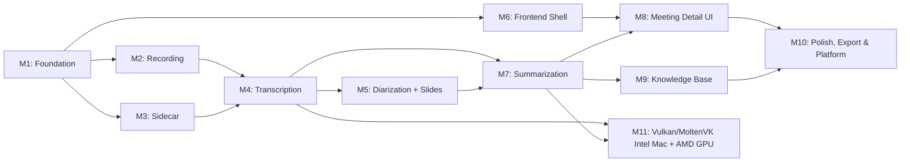

# Locus v1 — Implementation Plan

**Version:** 1.0 · **Created:** 2026-09-26
**Status:** Approved for dispatch — awaiting model/contributor assignments
**Governing:** [PRD](./PRD.md) (scope) · [SPEC](./SPEC.md) (behavior/acceptance) · [DESIGN](./DESIGN.md) (architecture) · [CONTEXT](../../CONTEXT.md) (terms)
**Frontend visual authority:** [Root DESIGN](../../DESIGN.md) (impeccable design system) · [FRONTEND_DESIGN](./FRONTEND_DESIGN.md) (bridge)

---

## Conventions

- **Task IDs** follow `M{milestone}.{sequence}` (e.g. M1.03).
- **Owner column** is blank — the maintainer assigns per-task model/contributor before dispatch.
- **Depends** lists task IDs that must be complete (gate passed) before this task starts.
- **SPEC** references the contract IDs that govern observable behavior.
- **Priority**: P0 = blocks downstream milestone work; P1 = required for v1.0 release; P2 = polish, defer if schedule-constrained.
- **Frontend tasks** follow [DESIGN.md](../../DESIGN.md) (impeccable root) for visual tokens, layout, and interaction specs.
- A task is **done** when its acceptance gate is met and the final revision passes applicable format/lint/type/build/test checks.

---

## Pre-Existing Assets

> [!NOTE]
> The `pyannote/speaker-diarization-community-1` model is **already downloaded locally** and available for bundling. No HuggingFace token is required at build or runtime. Sidecar packaging tasks (M3.02, M3.06) should reference the local model path rather than including a download step. The model's license and notice should be captured in bundled asset documentation.

---

## Dependency Graph (Milestone Level)

> [!IMPORTANT]
> Within each milestone, backend and frontend tasks can run in parallel once their specific `Depends` are satisfied. The milestone graph shows the coarse ordering; the task-level `Depends` column is authoritative.

---

## M1: Foundation & Scaffolding

**Goal:** Bootable Tauri + React shell with SQLite, monorepo CI, Python sidecar skeleton, and shared type contracts.

| ID | Task | Priority | Depends | SPEC / PRD | Acceptance Gate | Owner |
|----|------|----------|---------|------------|-----------------|-------|
| M1.01 | **Monorepo scaffold**: Initialize `src-tauri/` (Cargo workspace, Tauri 2.11, `tauri.conf.json`), `src/` (Vite + React 19 + TS), `sidecar/` (Python pyproject.toml + PyInstaller spec). Pin `pnpm` via `packageManager` field, commit `pnpm-lock.yaml`. | P0 | — | DESIGN §7 | `pnpm install` + `cargo check` + `python -c "import sidecar"` succeed; repo structure matches DESIGN §7 monorepo layout | |
| M1.02 | **Tauri app bootstrap**: Minimal window with React root, Tauri command round-trip (`greet` → response), dev server hot reload working. | P0 | M1.01 | DESIGN §2, §3 | `pnpm tauri dev` launches window; invoke command returns typed response | |
| M1.03 | **SQLite foundation**: `rusqlite` dedicated worker thread, WAL mode, foreign keys enforced on every connection, migration runner, initial schema matching DESIGN §5 entity table (all tables, constraints, indexes). | P0 | M1.01 | DESIGN §5, SPEC §Database | Migrations run idempotently; `cargo test` validates FK enforcement, worker serialization, schema against DESIGN §5 entities | |
| M1.04 | **Keychain integration**: `keyring` crate wrapper for macOS Keychain / Windows Credential Manager / Linux Secret Service. Store, retrieve, delete credentials. Actionable error on missing/locked keychain, no plaintext fallback. | P0 | M1.01 | FR9.3, SPEC §Provider selection | `cargo test` stores/retrieves/deletes a test key; missing keychain returns structured error | |
| M1.05 | **JSON-RPC 2.0 protocol layer (Rust side)**: `sidecar/protocol.rs` — newline-delimited JSON codec, request ID tracking, typed result/error deserialization, frame size bounds, deadline enforcement. | P0 | M1.01 | DESIGN §8, SPEC §JSON-RPC | Unit tests: serialize requests, deserialize responses/errors/progress notifications, reject malformed frames, timeout handling | |
| M1.06 | **JSON-RPC 2.0 server (Python side)**: `sidecar/src/rpc/server.py` — stdin/stdout loop, method dispatch, version/capability handshake, progress notification emission, stderr-only logging. | P0 | M1.01 | DESIGN §8, SPEC §JSON-RPC | `pytest`: raw JSON-RPC requests → correct dispatch, handshake, error codes, progress notifications; stdout is protocol-only | |
| M1.07 | **Sidecar lifecycle manager (Rust)**: `sidecar/client.rs` — lazy start, health check, warm keep-alive, crash detection/restart, process ownership/reaping. | P0 | M1.05, M1.06 | SPEC §Sidecar lifecycle | Integration test: start sidecar, handshake, health check, simulate crash → restart, cleanup on app exit | |
| M1.08 | **CI pipeline**: GitHub Actions — `test.yml` (format, lint, `tsc`, `cargo test`, `pytest`, `pnpm test`), `build-macos.yml` (debug build, no signing). | P1 | M1.01–M1.07 | DESIGN §9 | CI green on push; catches intentional format/type/test failures | |
| M1.09 | **Shared type contracts**: Define Rust DTOs for commands/events (`MeetingDTO`, `PipelineStatusDTO`, `RecordingStateDTO`, etc.), generate/mirror TypeScript types in `src/lib/tauri.ts`. | P0 | M1.02 | DESIGN §8 | TypeScript types compile; round-trip test with mock Tauri commands | |

---

## M2: Recording & Capture

**Goal:** Record system audio + microphone + screen on macOS, produce recoverable segments, finalize to H.264/AAC MP4.

| ID | Task | Priority | Depends | SPEC / PRD | Acceptance Gate | Owner |
|----|------|----------|---------|------------|-----------------|-------|
| M2.01 | **Capture state machine**: `capture/mod.rs` — `idle → preparing → recording ↔ paused → finalizing → saved` plus `interrupted/recoverable`. Idempotent transitions, single active capture guard, Rust-owned lifecycle across route changes/window close. | P0 | M1.03 | SPEC §Capture and recovery | State transition unit tests; reject invalid transitions; concurrent start rejected | |
| M2.02 | **macOS ScreenCaptureKit adapter**: `capture/macos.rs` — system audio via SCK, separate microphone path (AVAudioEngine or CoreAudio), screen video. Permission preflight. | P0 | M2.01 | FR1.12, SPEC §Capture | Records 30s with system audio + mic + screen on macOS 13+; permission dialog triggers on first use | |
| M2.03 | **FFmpeg encoder process**: `capture/encoder.rs` — spawn bundled FFmpeg, write independently recoverable segments with durable manifest, separate audio tracks (mic, system, mixed), H.264/AAC finalization. Audio-only MP4 without dummy video. | P0 | M2.02 | FR1.11, FR1.13, SPEC §Capture lifecycle | Produces valid MP4 playable in external player; audio-only session produces audio-only MP4; segments individually decodable | |
| M2.04 | **Media timeline & pause**: Common monotonic media clock across all streams. Pause removes time from output. Duration excludes pause intervals. | P0 | M2.03 | FR1.10, SPEC §Capture and recovery | Pause 5s mid-recording; final MP4 has no gap; duration matches actual recording minus pauses | |
| M2.05 | **Crash recovery**: Durable manifest checkpoint; on restart, detect interrupted capture and offer recovery UI (never auto-restart). ≤5s tail loss target on validated storage. | P0 | M2.03 | FR12.3, SPEC §Capture and recovery | Force-kill during recording; relaunch → recovery offered; recovered MP4 loses ≤5s; prior segments intact | |
| M2.06 | **Capture source validation & edge cases**: Preflight permissions, source availability, disk headroom, encoder readiness. Disk full / sleep / permission revocation / source disconnection → stop and preserve. No silent source downgrade. | P0 | M2.02, M2.03 | FR12.1, SPEC §Capture and recovery | Tests for: no-permission rejection, disk-full stop-and-preserve, source disconnect mid-recording | |
| M2.07 | **Capture Tauri commands**: `commands/recording.rs` — `start_recording`, `stop_recording`, `pause_recording`, `resume_recording`, `get_recording_state`. Thin delegation to capture module. | P0 | M2.01–M2.06 | DESIGN §8 | Commands callable from frontend; return structured state DTOs | |
| M2.08 | **3-hour recording validation**: Duration warning at 3h (no auto-stop). Memory-bounded encoding. Test with synthetic 3h fixture. | P1 | M2.03 | FR12.5, SPEC §Capture | 3h recording completes without OOM; warning shown; no auto-termination | |

---

## M3: Python Sidecar ML Setup

**Goal:** VAD, diarization engine, slide detection, OCR, and ChromaDB all working in the sidecar with proper JSON-RPC methods registered.

> [!NOTE]
> The `pyannote/speaker-diarization-community-1` model is pre-downloaded locally. M3.02 and M3.06 should bundle from the existing local path — no download or HuggingFace token required at build or runtime.

| ID | Task | Priority | Depends | SPEC / PRD | Acceptance Gate | Owner |
|----|------|----------|---------|------------|-----------------|-------|
| M3.01 | **pyannote VAD method**: `sidecar/src/diarization/vad.py` — `vad(audio_path)` → speech region time ranges on mixed audio. Progress notifications. Empty speech = valid result. | P0 | M1.06 | FR2.10, SPEC §Transcription | `pytest` with fixture: returns speech regions; empty audio returns empty result; progress emitted | |
| M3.02 | **pyannote diarization method**: `sidecar/src/diarization/engine.py` — `diarize(audio_path, single_person)` → speaker-labeled time segments. Bundle from **pre-downloaded local** `pyannote/speaker-diarization-community-1` model. No HuggingFace token at build or runtime. | P0 | M1.06 | FR3.1, FR3.2, SPEC §Diarization | `pytest` with 2-speaker fixture: returns ≥2 distinct speaker labels; `single_person=true` assigns User; no network calls during test | |
| M3.03 | **OpenCV slide detection method**: `sidecar/src/slides/detector.py` — `detect_slides(video_path)` → list of unique slides with timestamps and transition occurrences. Uses `opencv-python-headless`. | P1 | M1.06 | FR4.1, FR4.2, FR4.3, SPEC §Slides | `pytest` with 5-slide video fixture: returns 5 slides with timestamps within ±2s of actual transitions | |
| M3.04 | **Tesseract OCR method**: `sidecar/src/slides/ocr.py` — `ocr_slide(image_path)` → extracted text. Bundled Tesseract + traineddata. | P1 | M3.03 | FR4.4, SPEC §Slides | `pytest`: OCR of clean slide image returns expected text content | |
| M3.05 | **ChromaDB vector store**: `sidecar/src/vectordb/store.py` — `upsert_vectors`, `query_vectors`, `delete_vectors` RPC methods. Persists to disk. Collection-per-index-generation. Deterministic chunk IDs. | P0 | M1.06 | FR10.5, SPEC §Knowledge Base | `pytest`: upsert, query similarity, delete, persistence across sidecar restart | |
| M3.06 | **Sidecar PyInstaller packaging**: `sidecar/build.spec` — standalone binary with **locally pre-downloaded pyannote model**, OpenCV headless, Tesseract, ChromaDB. Zero Python/pip/network/HF-token requirement at runtime. | P1 | M3.01–M3.05 | SPEC §Distribution | Built binary runs handshake, VAD, diarize, slides on a clean machine without Python installed or network access | |

---

## M4: Transcription

**Goal:** whisper-rs transcription with VAD-guided chunking, GPU acceleration, model management.

| ID | Task | Priority | Depends | SPEC / PRD | Acceptance Gate | Owner |
|----|------|----------|---------|------------|-----------------|-------|
| M4.01 | **whisper-rs engine wrapper**: `transcription/engine.rs` — load model, transcribe audio chunk, return timestamped segments. GPU backend detection (Metal on Apple Silicon, CPU fallback). | P0 | M1.01 | FR2.1, FR2.5, SPEC §Transcription | 5-min English fixture → ≥80% word accuracy with `small` model; timestamps within ±1s | |
| M4.02 | **VAD-guided chunking (Rust orchestration)**: Request VAD from sidecar (M3.01), group speech regions into ≤5-min chunks splitting at lowest energy, dispatch to whisper-rs, merge results with original timeline offsets. Dedup at chunk boundaries. | P0 | M4.01, M3.01, M1.07 | FR2.10, FR2.11, SPEC §VAD-guided chunking | 30-min fixture with silence: chunks are ≤5 min; timestamps align to original timeline; no duplicate text at boundaries | |
| M4.03 | **Language detection & override**: Auto-detect via Whisper; manual language stored in meeting metadata and passed to engine. | P0 | M4.01 | FR2.3, FR2.4, SPEC §Transcription | Auto-detects English, Spanish, French on test fixtures; manual override forces language | |
| M4.04 | **Model manager (Rust core)**: `transcription/models.rs` + `models/mod.rs` — bundled small (read-only in bundle), configurable app-data models directory, download/import/delete/select with integrity verification (SHA-256). Expose curated catalog entries with disk/RAM estimates. | P1 | M1.03 | FR2.6, FR2.7, FR2.8, FR12.11 | Bundled small loads; download medium → verify hash → select → transcribe succeeds; delete removes files | |
| M4.05 | **Quantized model variants**: Catalog entries for verified q5_0, q5_1, q8_0 with measured sizes. | P1 | M4.04 | FR2.12, SPEC §Transcription | Quantized model downloads, loads, produces acceptable transcription | |
| M4.06 | **Transcription Tauri commands**: `commands/transcription.rs` — trigger transcription, get status/progress, get transcript segments. | P0 | M4.02 | DESIGN §8 | Commands return typed DTOs; progress updates during transcription | |
| M4.07 | **3-hour transcription validation**: Test with synthetic 3h fixture. Bounded memory on 8GB machine. VAD ≥30% time reduction vs raw. | P1 | M4.02 | FR2.9, NFR2a | 3h transcription completes; memory stays bounded; VAD reduces processing time ≥30% on silence-bearing fixture | |

---

## M5: Diarization & Slide Extraction

**Goal:** Speaker-attributed transcript segments and timestamped slide images with OCR text stored in SQLite.

| ID | Task | Priority | Depends | SPEC / PRD | Acceptance Gate | Owner |
|----|------|----------|---------|------------|-----------------|-------|
| M5.01 | **Diarization integration (Rust)**: Send audio to sidecar diarize method (using pre-downloaded pyannote model), receive speaker segments, merge with transcript segments. Store speaker entities and alignments in SQLite. Graceful fallback if diarization fails (undiarized transcript preserved). | P0 | M4.02, M3.02 | FR3.1, FR3.5, SPEC §Diarization | 2-speaker fixture → 2 distinct speakers in DB; diarization failure → transcript available without speakers | |
| M5.02 | **Speaker renaming**: Update speaker entity name; propagate to structured references in transcript and rendered summary without global text replacement. Preserve raw verbatim quotes. | P1 | M5.01 | FR3.4, SPEC §Processing, revision | Rename "Speaker 1" → "Alice"; transcript shows "Alice"; raw quotes unchanged; summary speaker refs updated | |
| M5.03 | **Slide extraction integration (Rust)**: Trigger sidecar slide detection + OCR for video recordings. Store slide images to disk, metadata/OCR/timestamps in SQLite. Skip if no video source. | P1 | M3.03, M3.04, M2.03 | FR4.1–FR4.6, SPEC §Slides | 5-slide video → 5 images + OCR text + timestamps in DB; no-video recording → slides skipped with reason | |
| M5.04 | **Audio track routing for diarization**: Diarize both source streams by default with provenance. "Only me on this microphone" setting assigns mic to User. Handle overlap/echo without fabricating identity. | P0 | M5.01 | FR12.2, SPEC §Audio track routing | Multi-speaker mic fixture → multiple speakers; single-person enabled → mic speech = User; overlap remains uncertain | |

---

## M6: Frontend Shell & Core Layout

**Goal:** Astryx + Tailwind design system, sidebar navigation, routing, all 6 views scaffolded with loading/empty/error states.

| ID | Task | Priority | Depends | SPEC / PRD | Acceptance Gate | Owner |
|----|------|----------|---------|------------|-----------------|-------|
| M6.01 | **Design system setup**: Astryx installation, TailwindCSS config with Editorial Botanical OKLCH tokens from root DESIGN.md (light/dark mode), typography scale (system sans-serif + JetBrains Mono tabular), 8pt spacing grid. `prefers-color-scheme` support. | P0 | M1.01 | Root DESIGN §Color, §Typography | Tokens render correctly; dark/light mode toggles; contrast passes WCAG AA (13.8:1 body copy on paper ground) | Gemini 3.8 Flash High |
| M6.02 | **App shell & sidebar**: 240px persistent sidebar (collapsible to 60px icon rail) with 5 nav items: Recording, Meetings, Knowledge Base, Model Manager, Settings. Active green pill indicator. Footer: offline status pill, downloads indicator. | P0 | M6.01 | Root DESIGN §Master Frame, DESIGN §6 | Sidebar renders; navigation works; collapse/expand; active state highlighted; footer shows status | Gemini 3.8 Flash High |
| M6.03 | **TanStack Router setup**: File-based routes for `/record`, `/` (meetings), `/meeting/:id`, `/knowledge`, `/models`, `/settings`. Type-safe route params. | P0 | M6.02 | DESIGN §6 | All routes resolve; type-safe params; 404 fallback | Gemini 3.8 Flash High |
| M6.04 | **TanStack Query + Zustand setup**: Query client config, typed Tauri command wrappers in `lib/tauri.ts`, Zustand stores for recording UI state and UI preferences. Window reopen resynchronization. | P0 | M6.03, M1.09 | DESIGN §6, §Frontend ownership | Queries fetch mock data; Zustand persists recording state; refocus triggers resync | Gemini 3.8 Flash High |
| M6.05 | **View scaffolds with states**: All 6 views with loading skeleton, empty state, and error boundary. Keyboard navigation for all interactive elements. | P1 | M6.03, M6.04 | NFR16, NFR17, Root DESIGN §States | Each route renders appropriate state; Tab navigation works; screen reader attributes present | Gemini 3.8 Flash High |

---

## M7: Summarization & LLM Integration

**Goal:** Local llama-server, cloud API providers, prompt routing, summary revisions, action items, automatic titles.

| ID | Task | Priority | Depends | SPEC / PRD | Acceptance Gate | Owner |
|----|------|----------|---------|------------|-----------------|-------|
| M7.01 | **llama-server process manager**: `llm/llama_cpp.rs` — spawn bundled binary, loopback-only binding, per-launch auth token, health check, model loading, HTTP completion/embedding API client, graceful shutdown/reap. | P0 | M1.01 | FR5.2, SPEC §Provider selection | llama-server starts, health checks pass, completion request returns response, loopback-only verified | |
| M7.02 | **Cloud API clients**: `llm/openai.rs`, `llm/anthropic.rs`, `llm/gemini.rs` — typed HTTP clients for chat completion. Credentials from keychain (M1.04). Redacted config for frontend. | P0 | M1.04 | FR5.4, FR9.2, SPEC §Provider selection | Each client sends completion request with test key; credentials never in logs/frontend DTOs | |
| M7.03 | **Ollama client**: `llm/ollama.rs` — discover loopback, configurable endpoint, classify non-loopback as remote. | P1 | M1.01 | FR5.3, SPEC §Provider selection | Loopback Ollama detected; non-loopback flagged remote; completion request works | |
| M7.04 | **Provider selection & disclosure**: Explicit provider selection model — configured ≠ selected. Destination disclosure before first use. No silent remote failover. Snapshot provider/model per job. | P0 | M7.01, M7.02, M7.03 | SPEC §Provider selection, FR12.8 | Saving key alone doesn't send data; selecting provider shows disclosure; job snapshots provider | |
| M7.05 | **Prompt routing**: `llm/prompts.rs` — keyword heuristics classify transcript → business/lecture/generic prompt template. User override stored per meeting. | P1 | M4.02 | FR5.5, FR5.6, FR5.10, SPEC §Prompt routing | "sprint" transcript → business prompt; "exam" transcript → lecture prompt; override changes template | |
| M7.06 | **Summarization pipeline step**: Orchestrator waits for transcript + terminal diarization/OCR states → generate summary revision. Hierarchical passes for long transcripts. Structured output: overview, action items (assignees, deadlines), decisions, citations. Store revision in SQLite. | P0 | M7.04, M7.05, M5.01 | FR5.1, FR5.5, FR5.6, SPEC §Processing | Transcript → summary with action items in DB; diarization failure → summary from undiarized transcript with disclosure | |
| M7.07 | **Summary revision management**: Explicit regeneration creates new revision, preserves previous. Action item completion state owned by revision. No text-match transfer of completions. | P0 | M7.06 | FR12.6, SPEC §Processing, revision | Regenerate → new revision; old revision intact with checked items; new revision items unchecked | |
| M7.08 | **Action item tracking**: Toggle completion state per item in SQLite, scoped to `summary_revision_id`. | P1 | M7.06 | FR5.8, SPEC §Processing | Check item → persisted; survives app restart; new revision doesn't inherit completion | |
| M7.09 | **Automatic title generation**: Date/time placeholder → concise title from whole-session summary (or bounded transcript passages). Publish only if user hasn't edited. Late results don't overwrite user rename. | P1 | M7.06 | FR12.12, SPEC §Processing | Auto-title appears after summarization; user rename survives re-summarization; title_origin tracks correctly | |
| M7.10 | **Summarization Tauri commands**: `commands/summarization.rs` — trigger summary, get summary revisions, get action items, toggle completion, retry. | P0 | M7.06–M7.08 | DESIGN §8 | Commands return typed DTOs; trigger/retry/toggle work correctly | |
| M7.11 | **Generation model manager**: Download/import GGUF generation models via skippable setup. Sizes, progress, cancel/retry, integrity verification. | P1 | M7.01, M4.04 | FR5.2, FR12.14 | Model downloads with progress; skip proceeds without blocking recording; imported model loads correctly | |

---

## M8: Meeting Detail UI & Playback

**Goal:** Full meeting detail view with video/audio player, synchronized transcript, summary tabs, slides gallery, pipeline status, and export.

| ID | Task | Priority | Depends | SPEC / PRD | Acceptance Gate | Owner |
|----|------|----------|---------|------------|-----------------|-------|
| M8.01 | **Video/audio player component**: Plyr or Video.js in Tauri webview. Standard controls (play/pause, seek, volume, speed 0.75×–2.0×, fullscreen). Audio-only: dedicated audio transport card (no blank video). `convertFileSrc` for local file playback. | P0 | M6.05 | FR7.1, Root DESIGN §Meeting Detail Studio | Video plays local MP4; audio-only shows audio card; speed control works; seek < 200ms response | Gemini 3.8 Flash High |
| M8.02 | **Synchronized transcript view**: Virtualized list of timestamped, speaker-labeled segments. Active line: 3px mint accent bar, background shift, auto-scroll to center (pause 8s on manual scroll, "Jump to current" pill). Click timestamp → seek. `onTimeUpdate` → highlight. | P0 | M8.01, M4.06, M5.01 | FR7.2, FR7.3, FR7.4, Root DESIGN §Transcript Engine | Click line → video seeks; playing highlights active line; manual scroll pauses auto-scroll; jump pill appears | Gemini 3.8 Flash High |
| M8.03 | **Speaker visual distinction**: Unique color per speaker from diarization palette (7 hues from root DESIGN). Speaker label + color; color is never sole identifier. | P1 | M8.02, M5.01 | FR3.3, NFR18, Root DESIGN §Speaker palette | Each speaker has distinct color + label; colorblind-safe (labels always present) | Gemini 3.8 Flash High |
| M8.04 | **Summary tab**: AI summary with structured sections (overview, decisions, key concepts). Timestamp citations (`[14:32]`) clickable → seek. Outdated banner when source changed. Revision history dropdown. | P0 | M8.01, M7.10 | FR7.5, Root DESIGN §AI Summary Tab | Summary renders; click citation → seeks; outdated banner shows after source update; revision switching works | Gemini 3.8 Flash High |
| M8.05 | **Action items tab**: Checkable tasks with assignee badge, deadline pill. Check → strikethrough + SQLite update. Revision-owned completion. | P1 | M8.04, M7.08 | FR5.8, Root DESIGN §Action Items Tab | Check item → visual strikethrough; persists; new revision items independent | Gemini 3.8 Flash High |
| M8.06 | **Slides gallery tab**: Grid of slide thumbnails with timestamp badges, slide numbers, OCR snippets. Click → seek video. Empty state: "No presentation slides in this recording". Slide/OCR failure → inline retry banner. | P1 | M8.01, M5.03 | FR7.6, FR7.7, Root DESIGN §Slides Strip | 5 slides render; click seeks; empty state shows for audio-only; failed OCR shows retry | Gemini 3.8 Flash High |
| M8.07 | **Pipeline status display**: Per-step status (pending/running/done/error/blocked/skipped/canceled) with reason. Progress percentage. Retry button per failed step. Outdated indicators. | P0 | M6.04, M7.10 | FR6.5, FR6.6, SPEC §Error handling | Each step shows correct state; retry triggers individual step; outdated results distinguishable | Gemini 3.8 Flash High |
| M8.08 | **Meetings list view**: Browse past meetings — title, date/time, duration, speaker count, type badge, processing status. Search by title. Filter by type and date range. Delete with confirmation. | P0 | M6.05, M1.09 | FR6.1, FR6.2, FR6.3, FR6.4 | List renders meetings; search filters; type/date filter works; delete removes meeting + files | Gemini 3.8 Flash High |
| M8.09 | **Export functions**: Clipboard copy (one-click), Markdown file, PDF, JSON. Triggered from meeting detail. | P1 | M8.04 | FR8.1–FR8.4 | Clipboard paste produces formatted summary; MD/PDF/JSON files are valid and contain transcript + summary | Gemini 3.8 Flash High |

---

## M9: Knowledge Base

**Goal:** Document upload, embedding pipeline, ChromaDB integration, cited multi-scope RAG chat, thread persistence.

| ID | Task | Priority | Depends | SPEC / PRD | Acceptance Gate | Owner |
|----|------|----------|---------|------------|-----------------|-------|
| M9.01 | **Embedding model manager**: GGUF embedding model via llama-server. Skippable download/import setup. Size, progress, integrity verification. | P0 | M7.01, M7.11 | FR10.4, FR12.14 | Embedding model downloads; generates vectors; skip leaves recording usable | |
| M9.02 | **Embedding pipeline (Rust)**: Request embeddings from llama-server, send explicit vectors to ChromaDB via sidecar RPC. Model version + chunker version track freshness. Never mix incompatible vector spaces. Index generation management. | P0 | M9.01, M3.05 | FR10.5, SPEC §Knowledge Base | Vectors stored in ChromaDB with model/version metadata; generation switch builds new collection | |
| M9.03 | **Source indexing (durable, independent)**: Background jobs index transcripts, slide text, and documents independently as each becomes available. Summary indexed when ready. Persistent readiness/error per source. Retry controls. | P0 | M9.02 | FR10.9, SPEC §Embedding pipeline | Transcript indexed without waiting for summary; error shows retry; survives app restart | |
| M9.04 | **Document upload & ingestion**: Text-bearing PDF (Rust extraction), Markdown, plain text. ≤50 MiB, ≤500 PDF pages. Reject encrypted/image-only/oversized with actionable messages. SHA-256 dedup. Store page locations/text offsets for citations. | P0 | M9.02 | FR10.2, FR12.10, SPEC §Document upload | Upload PDF → text extracted, chunked, indexed; duplicate rejected with existing doc returned; encrypted PDF → actionable error | |
| M9.05 | **Document-meeting linking**: Link documents to meetings (many-to-many). Documents exist independently. Unlinking doesn't delete document. | P1 | M9.04 | FR10.3, SPEC §Knowledge Base | Link doc to meeting; doc appears in meeting context; unlink preserves doc in KB | |
| M9.06 | **Semantic search**: Vector search across meetings and documents via ChromaDB. Scope-aware (this meeting, all meetings, docs only, everything). Source eligibility filtered from SQLite before retrieval. | P0 | M9.03 | FR10.6, SPEC §Knowledge Base | Search "pricing model" → returns relevant meeting; scope filtering works correctly | |
| M9.07 | **RAG chat backend**: Multi-turn chat with retrieval. Retrieve relevant chunks → build context → send to selected LLM. Citations to timestamps/pages/offsets. Insufficient evidence → explicit "I don't have enough information". Persist threads locally with fixed scope. | P0 | M9.06, M7.04 | FR10.7, FR12.8, FR12.9, SPEC §Chat | "What did we decide about X?" → answer with citations; scope change → new thread; citations navigable | |
| M9.08 | **Per-meeting Q&A**: Meeting detail "Ask about this meeting" input. Scoped to meeting transcript, slide text, current summary, linked documents. | P1 | M9.07 | FR10.8 | Question about meeting → scoped answer with transcript citations | |
| M9.09 | **Knowledge Base UI**: Chat-first interface. Secondary thread sidebar. LLM model/provider selector in chat input. Scope toggles. Document upload area. Semantic search. Streaming markdown responses. `[Incomplete Response]` on cancel. | P0 | M6.05, M9.07 | FR10.1, FR10.10, Root DESIGN §Knowledge Base | Chat renders; scope toggle works; thread list navigable; streaming responses; provider selector shows destination | |
| M9.10 | **In-meeting chat drawer**: Scoped chat in meeting detail view. Same RAG backend, fixed to meeting scope. | P1 | M8.01, M9.07 | Root DESIGN §In-Meeting Chat | Chat in meeting detail; scoped to this meeting; citations clickable to seek | |

---

## M10: Polish, Export & Platform Expansion

**Goal:** Recording view UI, settings, deletion protocol, model/storage migration, auto-update, Linux + Windows platform support.

| ID | Task | Priority | Depends | SPEC / PRD | Acceptance Gate | Owner |
|----|------|----------|---------|------------|-----------------|-------|
| M10.01 | **Recording view UI**: Capture source toggles (System Audio, Mic, Screen), meeting type selector, meeting title input, "Only me on this mic" toggle, record button. ≤2-click initiation. Live HUD: pulsing red beacon, tabular timer, VU meters, pause/resume, stop. 3h advisory banner. | P0 | M6.05, M2.07 | FR1.1–FR1.10, Root DESIGN §Capture HUD | Source toggles work; record starts in ≤2 clicks; timer/VU update live; pause/resume works; 3h banner shows | |
| M10.02 | **Close-to-background capture**: Window close during recording → minimize to system tray with notification. Trayless fallback: compact floating control window. Quit → "Stop and save" / "Cancel" modal. | P0 | M10.01 | FR12.4, Root DESIGN §Window-close protection | Close during recording → tray; reopen shows capture; quit → modal; trayless Linux → floating window | |
| M10.03 | **Settings view**: 3-column layout (sidebar → category nav → content). Categories: General, Appearance (theme toggle), Recording Defaults, LLM Providers (local + remote config with redacted display), Storage, Privacy. | P1 | M6.05, M7.04 | FR9.1–FR9.7, DESIGN §6 | Settings render; theme toggles; provider config saves to keychain; storage info displays | |
| M10.04 | **Model Manager UI**: Unified hub for Whisper, generation, embedding models. Catalog cards with RAM/disk estimates, status badges, download/delete/select actions. Skippable first-launch flow. | P1 | M6.05, M4.04, M7.11, M9.01 | DESIGN §6, Root DESIGN §Model Manager | Catalog renders; download with progress; select changes active model; skip proceeds without blocking | |
| M10.05 | **Deletion protocol (Rust)**: Tombstone + generation fence in SQLite → immediate query exclusion. Durable cleanup: media, artifacts, vectors, scoped threads, affected mixed-chat messages + dependent turns. Fence in-flight jobs. Meeting deletion preserves independent linked documents. Retry incomplete cleanup on restart. | P0 | M1.03, M3.05 | FR6.4, FR12.7, SPEC §Deletion | Delete meeting → immediate exclusion from queries; vectors removed; linked docs survive; retry racing deletion blocked | |
| M10.06 | **Pipeline orchestrator**: Full step sequencing per DESIGN §4 pipeline graph. Balanced (default) and Maximum parallelism modes. Capture priority — suspend/defer inference during recording. Durable job queue. Cancel non-cooperative workers. | P0 | M2.01, M4.02, M5.01, M7.06, M9.03 | SPEC §Pipeline, DESIGN §4 | Full pipeline runs end-to-end on fixture; Balanced defers during capture; retry individual step works | |
| M10.07 | **Model storage migration**: Move managed models directory while idle. Preflight space/permissions, copy/verify, atomic switch, offer old-copy cleanup. Missing drives → models unavailable. | P1 | M4.04 | FR12.11, SPEC §Model storage | Migrate models to new path; verify; switch; old path offered for cleanup; unplug drive → models unavailable | |
| M10.08 | **Meeting data storage relocation**: Coordinate SQLite, ChromaDB, media. Only while data-changing workers idle. Migration journal. Recover before opening writable stores. | P2 | M1.03, M3.05 | FR9.5, SPEC §Storage relocation | Relocate storage; verify; works from new location; interrupted migration recovers | |
| M10.09 | **Auto-update**: Tauri updater — check single stable channel when enabled/online. Install with user action while capture/jobs idle. Manual GitHub Release download. Verified package install. | P1 | M1.02 | FR11.1–FR11.3, SPEC §Distribution | Update check works; install only when idle; manual download installs; offline app unaffected | |
| M10.10 | **Linux platform**: PipeWire audio + screen portal capture adapter (`capture/linux.rs`). AppImage + Flatpak packaging. Secret Service keychain. Linux CI. PipeWire-only (no PulseAudio/X11). | P0 | M2.01 | FR1.14, NFR12a, SPEC §Capture | Records audio+screen via PipeWire on Ubuntu 22.04; produces valid MP4; AppImage runs on clean machine | |
| M10.11 | **Windows platform**: Windows Graphics Capture + WASAPI adapter (`capture/windows.rs`). CUDA/ROCm whisper-rs builds. Windows installer. Windows CI. | P0 | M2.01 | FR1.12, NFR11, SPEC §Capture | Records audio+screen via WGC+WASAPI on Win10; CUDA transcription; installer runs on clean machine | |
| M10.12 | **Cross-platform CI expansion**: `build-linux.yml`, `build-windows.yml`. CPU-baseline tests on all platforms. Format/lint/type/build gates. | P1 | M10.10, M10.11, M1.08 | DESIGN §9 | CI green on all 3 platforms; catches failures | |
| M10.13 | **Release qualification**: Per-platform evidence checklist — capture, GPU, clean install, signing/notarization (macOS), upgrade, offline first-launch, 3h recording. Bundled assets complete (including pre-downloaded pyannote model). License notices. PR evidence template. | P0 | All above | SPEC §Contributor/release, DESIGN §9 | Documented evidence for each platform; all bundled assets verified; license notices present | |

---

## M11: Vulkan/MoltenVK GPU Acceleration (Intel Mac + AMD GPU)

**Goal:** Qualify and ship Vulkan-based GPU acceleration via MoltenVK for whisper.cpp transcription and llama-server summarization/embeddings on Intel Macs with discrete AMD GPUs, providing a significant speedup over CPU-only fallback.

> [!IMPORTANT]
> **Why a separate milestone:** Intel Macs with AMD dGPUs (e.g. Radeon Pro 5500M, 5600M, Vega) cannot use Metal for whisper.cpp/llama.cpp the same way Apple Silicon does. Native Metal support for AMD dGPUs on Intel Macs has known correctness issues ([llama.cpp PR #19527](https://github.com/ggml-org/llama.cpp/pull/19527) addresses Metal, not MoltenVK). Vulkan via MoltenVK is the viable GPU path for these machines but requires careful qualification due to known pitfalls.

### Known Issues & Research (as of 2026-09)

| Issue | Root cause | Mitigation |
|-------|-----------|------------|
| **Garbage/gibberish output on AMD dGPUs** ([ggml-org/llama.cpp#20029](https://github.com/ggml-org/llama.cpp/issues/20029)) | Flash Attention kernels don't map correctly to AMD GPUs through MoltenVK's Vulkan→Metal translation | Disable Flash Attention: `-fa 0` / `--flash-attn 0` |
| **FP16 incompatibilities** | Some AMD Vulkan drivers mishandle 16-bit float operations via MoltenVK | Set `GGML_VK_DISABLE_F16=1` at runtime |
| **Dual-GPU splitting (iGPU + dGPU)** | Intel iGPU and AMD dGPU both appear as Vulkan devices; model splits across both → corrupt output | Force single device: `GGML_VK_VISIBLE_DEVICES=0` (select AMD dGPU only) |
| **MoltenVK translation overhead** | Vulkan→Metal translation layer adds latency vs native Metal on Apple Silicon | Expected; still significantly faster than CPU-only on AMD dGPUs with 4–8 GB VRAM |

### Reference: Community Vulkan Fork

[1zilc/llama.cpp-mac_x64-vulkan](https://github.com/1zilc/llama.cpp-mac_x64-vulkan/releases) provides prebuilt llama.cpp binaries for macOS x64 with Vulkan/MoltenVK enabled. This fork demonstrates the viability of the path but is **not suitable for direct bundling** — Locus requires reproducible builds from reviewed source with pinned commits/checksums per DESIGN §9. The fork serves as a correctness reference and build recipe guide.

### Tasks

| ID | Task | Priority | Depends | SPEC / PRD | Acceptance Gate | Owner |
|----|------|----------|---------|------------|-----------------|-------|
| M11.01 | **Vulkan/MoltenVK spike for whisper.cpp**: Build whisper.cpp with `-DGGML_VULKAN=1` against MoltenVK SDK on Intel Mac + AMD dGPU. Verify device detection, transcription correctness (≥80% word accuracy on 5-min English fixture vs CPU baseline), and measure speedup. Document required environment variables (`GGML_VK_DISABLE_F16`, `GGML_VK_VISIBLE_DEVICES`). | P1 | M4.01 | FR2.5, US-14, SPEC §Transcription, PRD Risk "Vulkan + MoltenVK untested" | Whisper transcription runs on AMD dGPU via Vulkan; output matches CPU baseline quality; speedup measured and recorded | |
| M11.02 | **Vulkan/MoltenVK spike for llama.cpp (llama-server)**: Build llama.cpp with `-DGGML_VULKAN=1` against MoltenVK SDK. Test completions and embeddings on Intel Mac + AMD dGPU with Flash Attention disabled (`-fa 0`). Verify no garbage output. Document FP16/FA workarounds. Reference [#20029](https://github.com/ggml-org/llama.cpp/issues/20029) and [1zilc fork](https://github.com/1zilc/llama.cpp-mac_x64-vulkan/releases) build recipes. | P1 | M7.01 | FR5.2, SPEC §Provider selection, DESIGN §9 | llama-server generates correct completions and embeddings on AMD dGPU via Vulkan; no garbage output; workarounds documented | |
| M11.03 | **Vulkan backend runtime detection & selection (whisper-rs)**: Extend `transcription/engine.rs` GPU backend detection to recognize Vulkan devices on macOS Intel + AMD. Apply required workarounds (`GGML_VK_DISABLE_F16=1`, `GGML_VK_VISIBLE_DEVICES` to select dGPU only). Graceful fallback to CPU if Vulkan initialization fails or no AMD dGPU found. | P1 | M11.01, M4.01 | FR2.5, US-15, SPEC §Transcription GPU candidates | Vulkan auto-selected on Intel Mac + AMD dGPU; CPU fallback on Intel-only Mac; no user configuration required for happy path | |
| M11.04 | **Vulkan backend for llama-server process manager**: Extend `llm/llama_cpp.rs` to pass Vulkan flags and workaround environment variables when launching llama-server on Intel Mac + AMD dGPU. Flash Attention disabled by default for Vulkan path. Single-device enforcement. | P1 | M11.02, M7.01 | FR5.2, SPEC §Provider selection | llama-server launches with Vulkan on AMD dGPU; correct output; Flash Attention off; single GPU enforced | |
| M11.05 | **Reproducible Vulkan build recipe**: Pin exact llama.cpp and whisper.cpp commits with Vulkan enabled. Document MoltenVK SDK version, build flags, checksums for prebuilt artifacts. Ensure builds are reproducible and not based on floating fork releases. Record license notices for MoltenVK (Apache 2.0). | P1 | M11.01, M11.02 | DESIGN §9 "pin a custom fork only if required by measured results" | Build recipe produces identical artifacts; checksums recorded; MoltenVK license in notices | |
| M11.06 | **Vulkan macOS packaging variant**: Produce macOS Intel installer/DMG that includes Vulkan-enabled whisper.cpp and llama-server binaries alongside MoltenVK dylib. Runtime detects AMD dGPU presence and selects Vulkan or CPU path. Apple Silicon builds remain Metal-only (no Vulkan overhead). | P1 | M11.03, M11.04, M11.05, M10.13 | DESIGN §9, NFR10 | Intel Mac DMG includes Vulkan binaries; Apple Silicon DMG remains Metal; clean install on Intel Mac with AMD dGPU uses GPU; Intel Mac without AMD dGPU falls back to CPU | |
| M11.07 | **Vulkan performance benchmarks & qualification**: Measure transcription (60-min, 3h fixtures) and summarization speedup on at least 2 AMD dGPU models (e.g. Radeon Pro 5500M 4GB, Radeon Pro 5600M 8GB). Compare vs CPU baseline. Document memory usage, VRAM limits, and model size constraints per GPU VRAM. | P1 | M11.03, M11.04 | NFR1, NFR2, SPEC §Feasibility gates | Benchmarks recorded with exact hardware/driver/model; speedup > 2× over CPU on target fixtures; no OOM on models within VRAM budget | |

---

## Cross-Cutting Concerns (threaded through all milestones)

These are not separate tasks but requirements that apply across multiple tasks:

| Concern | Where it applies | SPEC reference |
|---------|-----------------|----------------|
| **Untrusted input**: Transcripts, documents, model outputs are untrusted text; never execute as commands | All sidecar/LLM/document paths | SPEC §Provider selection |
| **No telemetry**: Zero data collection; disable dependency telemetry/network defaults | Sidecar, llama-server, all network code | NFR7 |
| **Accessibility**: Keyboard navigation, ARIA attributes, color never sole indicator, `focus-visible` rings | All frontend tasks | NFR16–18, Root DESIGN §Accessibility |
| **Content redaction**: Credentials never in logs/DTOs; managed server per-launch auth; redact from errors | Keychain, LLM, settings, error handling | SPEC §Provider selection |
| **Monotonic media timeline**: All timestamps reference single media clock | Capture, transcript, slides, citations, player | SPEC §Capture |
| **Revision preservation**: Never silently overwrite; retain previous successful output during retry/failure | Summary, transcript, slides, index | SPEC §Processing |
| **Pre-downloaded pyannote model**: Bundle from local path; no HF token or network access at build/runtime | M3.02, M3.06, M5.01, M10.13 | FR3.2 |

---

## Frontend–Backend Integration Sequence

This is the recommended order for connecting frontend views to backend commands:

1. **M6 Shell** → mock Tauri commands with fixtures from M1.09 type contracts
2. **M8.08 Meetings list** → connect to real `list_meetings` / `delete_meeting` commands
3. **M10.01 Recording view** → connect to `start/stop/pause/resume` capture commands
4. **M8.01–M8.02 Player + Transcript** → connect to `get_meeting` / `get_transcript` / media file serving
5. **M8.04–M8.06 Summary + Actions + Slides** → connect to summary/action/slide commands
6. **M8.07 Pipeline status** → connect to `get_pipeline_status` / `retry_step` commands
7. **M9.09 Knowledge Base UI** → connect to chat/search/upload commands
8. **M10.03–M10.04 Settings + Model Manager** → connect to settings/model commands

---

## Document Consistency Notes

After reviewing all governing documents, the following alignment was confirmed:

| Check | Result |
|-------|--------|
| Root DESIGN.md (impeccable) ↔ FRONTEND_DESIGN.md | ✅ Consistent — FRONTEND_DESIGN is a pointer/bridge to root DESIGN |
| Root DESIGN.md ↔ docs/plans/DESIGN.md frontend section | ✅ Consistent — backend DESIGN §6 defers visual details to root DESIGN; component stack/routes match |
| PRODUCT.md ↔ PRD.md | ✅ Consistent — PRODUCT.md is a high-level summary of PRD; same personas, principles, constraints |
| PRD requirements ↔ SPEC contracts | ✅ Consistent — every FR maps to SPEC user stories and behavioral contracts |
| SPEC ↔ DESIGN architecture | ✅ Consistent — SPEC references DESIGN modules; DESIGN implements SPEC contracts |
| CONTEXT.md terminology | ✅ Used throughout — "summary revision", "selected provider", "configured provider", "capture source", "meeting type" |

No contradictions found. The document set is well-synchronized.

---

## What This Plan Does NOT Cover

- Feasibility spike tasks (assumed validated before implementation begins)
- TDD red-green-refactor cycles (tests are acceptance gates, not driving the workflow)
- ADR authoring (existing ADRs in `docs/adr/` remain reference material)
- v2/v3 features (real-time transcription, dashboard, calendar, image context, prompt editor, speaker profiles, mobile)
- The `manual/` execution coordination (BACKEND-SLICES.md, FRONTEND-SLICES.md) — the maintainer manages dispatch

The **Owner** column is intentionally blank. The maintainer assigns models/contributors per task before dispatch, per AGENTS.md rules.
