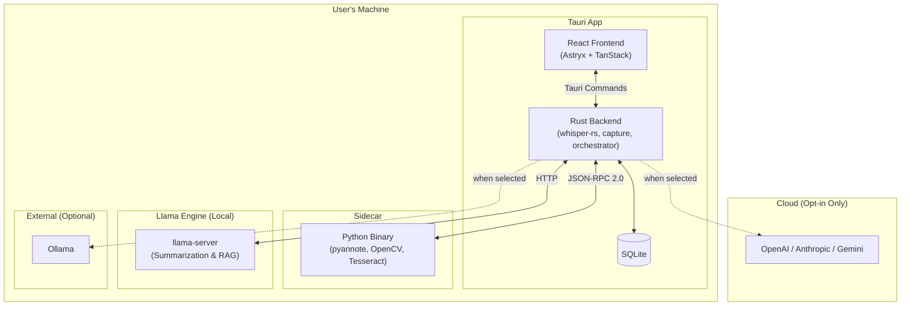

# Locus — Product Requirements Document (PRD)

> **Source of Truth** — This document defines *what* Locus does and *why*. For *how* it's built, see [DESIGN.md](./DESIGN.md). For engineering-level user stories and testing, see [SPEC.md](./SPEC.md).

**Version**: 1.1
**Last Updated**: 2026-09-05
**Status**: Approved for implementation; engineering feasibility gates remain unverified
**License**: MIT for original Locus code; third-party code and model licenses/notices remain separate

---

## 1. Product Vision

**Locus is the open-source, offline-first meeting recorder that turns conversations into structured knowledge, with local processing by default and explicit provider selection for remote AI.**

Every meeting produces information that decays: action items are forgotten, deadlines are missed, decisions are relitigated. Cloud recording tools exist, but they require internet, send your data to third-party servers, and lock you into proprietary ecosystems. Locus eliminates all three problems by running recording, transcription, speaker identification, slide extraction, and AI summarization locally on the user's device. Capture, transcription, diarization, and slides work on a disconnected first launch. Local summarization and semantic search require model setup first; setup is skippable and supports local model import.

### Product Positioning

| | Cloud Tools (Otter, Fireflies, etc.) | Locus |
|---|---|---|
| Data privacy | ❌ Data sent to cloud servers | ✅ Local by default; remote AI only when selected |
| Internet required | ❌ Always | ✅ Offline after model setup; bundled capture/transcription available immediately |
| Vendor lock-in | ❌ Proprietary formats | ✅ Open source, standard formats (MP4, Markdown, JSON) |
| Cost | ❌ Monthly subscription | ✅ Free forever |
| Slide extraction | ❌ Rarely supported | ✅ Built-in (OpenCV + OCR) |
| Speaker ID | ⚠️ Often cloud-only | ✅ Local (pyannote) |
| Cross-platform | ⚠️ Varies | ✅ macOS + Windows + Linux (v1) |

---

## 2. Target Personas

### Persona 1: Knowledge Worker ("Morgan")

- **Role**: Product manager, engineer, designer, or team lead
- **Context**: Attends 4–8 meetings/week via Zoom, Google Meet, or Teams
- **Pain**: After back-to-back meetings, action items and decisions blur together. Manually writing notes during meetings is distracting.
- **Jobs to be done**:
  - Record a meeting without thinking about it
  - Get a list of action items + deadlines after the meeting
  - Find "what did we decide about X?" weeks later
  - Share meeting summaries with absent teammates
- **Success looks like**: After every meeting, Morgan has a clean summary with checkable action items within minutes, without having taken a single note.

### Persona 2: Student ("Alex")

- **Role**: University or online course student
- **Context**: Attends 2–4 lectures/week, some with slides. May be in a different timezone (recorded lectures).
- **Pain**: Keeping up with lecture notes while listening is hard. Misses nuances. Slides are shared inconsistently.
- **Jobs to be done**:
  - Record a lecture and get searchable notes afterward
  - Review specific moments by searching the transcript
  - Get slide content even when the professor doesn't share them
  - Study from auto-generated key concept summaries
- **Success looks like**: Alex records a 90-minute lecture and gets organized study notes with key concepts, extracted slides, and timestamps to revisit confusing sections.

### Shared Needs

Both personas need:
- Zero-friction recording (≤ 2 clicks to start)
- No cloud dependency (works on a plane, in a dorm, on restricted networks)
- Low resource usage (recording shouldn't slow down their machine)
- Private by default (no accounts, no telemetry, no data upload)

---

## 3. Product Principles

1. **Local by default, cloud by choice** — All supported local processing works offline after its required models are provisioned. Generation and embedding model setup is skippable; cloud APIs are optional.
2. **Capture everything, organize later** — The recording pipeline should be reliable and fire-and-forget. Organization (summaries, action items) happens automatically after the meeting.
3. **Partial results are better than no results** — If one pipeline step fails (e.g., diarization crashes), everything else that succeeded is still available. Preserve completed results and recoverable captured media; crash recovery targets at most the final five seconds of loss, subject to validated storage assumptions.
4. **The user controls their data** — Standard formats (MP4, SQLite, Markdown). No proprietary lock-in. Export everything.
5. **Smart defaults, full control** — Auto-detect language, auto-detect meeting type, auto-select GPU backend. But always let the user override.

---

## 4. Functional Requirements

### FR1: Meeting Recording

| ID | Requirement | Priority |
|----|------------|----------|
| FR1.1 | The app shall capture **system audio** from the operating system's audio output (to record meeting participants in a video call) | P0 |
| FR1.2 | The app shall capture **microphone audio** from the user's input device | P0 |
| FR1.3 | The app shall capture **screen video** (full screen or specific window) | P0 |
| FR1.4 | The user shall be able to independently enable/disable each capture source (system audio, microphone, screen) via toggle switches before recording | P0 |
| FR1.5 | Default capture sources shall be System Audio (on) + Screen (on) + Microphone (off) | P1 |
| FR1.6 | The user shall be able to enter a meeting title before or during recording | P0 |
| FR1.7 | The user shall be able to select a meeting type (Auto-detect, Meeting, Lecture) before recording | P1 |
| FR1.8 | The app shall display a live timer showing elapsed recording time | P0 |
| FR1.9 | The app shall display a live audio level indicator during recording | P1 |
| FR1.10 | The user shall be able to pause and resume recording | P1 |
| FR1.11 | Encode continuously into recoverable media using bundled FFmpeg; stopping finalizes H.264/AAC MP4. Audio-only recordings contain AAC without a dummy video track | P0 |
| FR1.12 | Native capture shall use ScreenCaptureKit plus microphone capture on macOS; Windows Graphics Capture for video plus WASAPI system-loopback/microphone audio; PipeWire audio and screen portal on Linux | P0 |
| FR1.13 | The app shall capture system audio and microphone audio as **separate audio tracks** (not mixed), preserving per-source audio for downstream processing | P0 |
| FR1.14 | On Linux, recording capture shall use PipeWire screen cast portal (Wayland) and PipeWire audio capture. Minimum requirement: PipeWire-enabled system (Ubuntu 22.04+, Fedora 34+, Arch Linux) | P0 |

### FR2: Transcription

| ID | Requirement | Priority |
|----|------------|----------|
| FR2.1 | After recording completes, the app shall automatically transcribe the audio using whisper-rs (whisper.cpp Rust bindings) | P0 |
| FR2.2 | Transcription shall produce timestamped text segments with start and end times | P0 |
| FR2.3 | The app shall auto-detect the spoken language using Whisper's built-in language detection | P0 |
| FR2.4 | The user shall be able to manually specify the language before recording via a dropdown | P1 |
| FR2.5 | Select a validated GPU backend when available, with tested CPU fallback. Platform/backend combinations are qualified through engineering gates rather than inferred solely from GPU vendor | P0 |
| FR2.6 | The app shall bundle the Whisper `small` model (466 MiB) for immediate out-of-box use | P0 |
| FR2.7 | The app shall provide an in-app model manager where users can download additional models (`tiny`, `base`, `medium`, `large-v3`) | P1 |
| FR2.8 | The model manager shall display estimated RAM/VRAM requirements per model | P2 |
| FR2.9 | Transcription shall run post-recording only (not real-time), using VAD-guided chunking for optimal performance on long recordings (up to 3 hours) | P0 |
| FR2.10 | The app shall run Voice Activity Detection (VAD) via pyannote before transcription to identify speech regions and skip silence | P0 |
| FR2.11 | The app shall chunk audio into VAD-guided segments with a maximum chunk length of 5 minutes, splitting at low-energy points when a speech region exceeds the maximum | P0 |
| FR2.12 | The model manager shall offer verified compatible standard/quantized Whisper variants (including q5_0, q5_1, q8_0 where supported), showing measured sizes and quality tradeoffs | P1 |

### FR3: Speaker Diarization

| ID | Requirement | Priority |
|----|------------|----------|
| FR3.1 | After transcription, the app shall run speaker diarization using pyannote-audio to assign speaker labels to transcript segments | P0 |
| FR3.2 | The pyannote `speaker-diarization-community-1` model shall be bundled with the app (no HuggingFace token required) | P0 |
| FR3.3 | Each identified speaker shall be assigned a distinct color for display in the UI | P1 |
| FR3.4 | The user shall be able to rename speaker labels (e.g., "Speaker 1" → "Alice") | P1 |
| FR3.5 | If diarization fails, the undiarized transcript shall remain available | P0 |

### FR4: Slide Extraction

| ID | Requirement | Priority |
|----|------------|----------|
| FR4.1 | For recordings that include screen capture, the app shall detect slide transitions using OpenCV frame differencing | P1 |
| FR4.2 | The app shall extract each unique slide as a separate image file | P1 |
| FR4.3 | Each extracted slide shall be linked to its timestamp in the recording | P1 |
| FR4.4 | The app shall extract text content from slide images using Tesseract OCR | P1 |
| FR4.5 | Extracted slide text shall be included in the context sent to the LLM for summarization | P1 |
| FR4.6 | Slide extraction shall run as a post-recording batch process (no impact on recording performance) | P0 |

### FR5: AI Summarization

| ID | Requirement | Priority |
|----|------------|----------|
| FR5.1 | After transcription (and optionally diarization + slide extraction), the app shall generate an AI-powered summary | P0 |
| FR5.2 | Bundle llama-server as the primary local generation engine; summarization weights are provisioned through skippable model setup, not bundled | P0 |
| FR5.3 | Make loopback Ollama available when detected at localhost:11434; use it only when selected. Configurable non-loopback endpoints require remote-destination disclosure | P1 |
| FR5.4 | The app shall support **cloud API providers** (OpenAI, Anthropic, Gemini) via user-provided API keys | P0 |
| FR5.10 | The app shall use **keyword heuristics** on the transcript to auto-detect meeting type and select the appropriate summarization prompt | P1 |
| FR5.5 | For **business meetings**, the summary shall include: overview, action items with deadlines and assignees, key decisions | P0 |
| FR5.6 | For **lectures**, the summary shall include: overview, key concepts, assignments/homework, important dates | P0 |
| FR5.7 | The user shall be able to override the auto-detected meeting type and re-run summarization with the corrected prompt | P1 |
| FR5.8 | Action items shall be individually checkable (mark as completed) | P1 |
| FR5.9 | If the LLM is unavailable, the transcript and slides shall remain viewable without a summary | P0 |

### FR6: Meeting Management

| ID | Requirement | Priority |
|----|------------|----------|
| FR6.1 | The app shall display a list of all past recordings showing: title, date/time, duration, number of speakers, meeting type badge, processing status | P0 |
| FR6.2 | The user shall be able to search meetings by title | P0 |
| FR6.3 | The user shall be able to filter meetings by type (Meeting, Lecture, All) and date range | P1 |
| FR6.4 | The user shall be able to delete meetings (including all associated files and data) | P0 |
| FR6.5 | Persist independent step state and reason: pending, running, done, error, blocked, skipped, canceled; expose outdated successful outputs separately | P0 |
| FR6.6 | The user shall be able to retry any individual failed pipeline step | P0 |

### FR7: Meeting Detail & Playback

| ID | Requirement | Priority |
|----|------------|----------|
| FR7.1 | The meeting detail view shall display video playback (Plyr or Video.js) with standard controls: play/pause, seek bar, volume, playback speed, fullscreen | P0 |
| FR7.2 | The meeting detail view shall display the transcript as a scrollable list of timestamped, speaker-labeled segments | P0 |
| FR7.3 | Clicking a transcript line shall seek the video player to that line's timestamp | P0 |
| FR7.4 | As the video plays, the currently active transcript line shall be visually highlighted | P0 |
| FR7.5 | The meeting detail view shall include a **Summary tab** showing the AI-generated summary and action items | P0 |
| FR7.6 | The meeting detail view shall include a **Slides tab** showing a gallery of extracted slide images with timestamps | P1 |
| FR7.7 | Clicking a slide in the gallery shall seek the video player to that slide's timestamp | P1 |

### FR8: Export

| ID | Requirement | Priority |
|----|------------|----------|
| FR8.1 | The user shall be able to **copy the summary to the clipboard** with one click | P0 |
| FR8.2 | The user shall be able to export the meeting as a **Markdown** file (transcript + summary) | P1 |
| FR8.3 | The user shall be able to export the meeting as a **PDF** document | P2 |
| FR8.4 | The user shall be able to export the meeting as a **JSON** file (structured data for programmatic access) | P2 |

### FR9: Settings & Configuration

| ID | Requirement | Priority |
|----|------------|----------|
| FR9.1 | The user shall be able to select the active Whisper model and download additional models | P0 |
| FR9.2 | The user shall be able to configure the LLM provider (Ollama URL, OpenAI API key, Anthropic API key, Gemini API key) | P0 |
| FR9.3 | API keys shall use OS keychain storage on macOS, Windows, and Linux Secret Service. If unavailable or locked, explain the issue and keep local features usable; no plaintext fallback | P0 |
| FR9.4 | The user shall be able to set default recording capture sources | P2 |
| FR9.5 | The user shall be able to configure the storage location for recordings and data | P2 |
| FR9.6 | The user shall be able to toggle between dark and light themes | P2 |
| FR9.7 | The app shall display current storage usage | P2 |

### FR10: Knowledge Base

| ID | Requirement | Priority |
|----|------------|----------|
| FR10.1 | The Knowledge Base (`/knowledge`) shall be chat-first, with a secondary thread sidebar, model/provider selector, semantic search, document management, and persistent indexing readiness | P0 |
| FR10.2 | The user shall be able to upload supporting documents (PDF text extraction, Markdown, plain text) to the Knowledge Base | P0 |
| FR10.3 | Uploaded documents shall be optionally linkable to one or more meetings | P1 |
| FR10.4 | Local embeddings shall use a GGUF embedding model via llama-server. A skippable setup flow offers download or local import; model sizes and progress are shown, and no model download is required to start recording | P0 |
| FR10.5 | Embeddings shall be stored in ChromaDB (running in the Python sidecar) for similarity search | P0 |
| FR10.6 | The Knowledge Base shall support semantic search across all meetings and documents ("find meetings where we discussed the pricing model") | P0 |
| FR10.7 | The Knowledge Base shall include a chat interface where users can ask questions answered via RAG (retrieve relevant chunks → send to LLM with question) | P0 |
| FR10.8 | The meeting detail view shall include an "Ask about this meeting" input for scoped Q&A using the meeting's transcript and linked documents | P1 |
| FR10.9 | Transcript, slide-text, and document indexing shall start independently as each source becomes available; summary indexing follows when available. Work is durable and unobtrusive, with persistent readiness/errors and retry controls | P1 |
| FR10.10 | The user shall be able to scope chat queries: "This meeting only", "All meetings", "Documents only", or "Everything" | P1 |

### FR11: Updates

| ID | Requirement | Priority |
|----|------------|----------|
| FR11.1 | Check the single stable update channel when enabled and online; install only with user action while capture and data-changing jobs are idle | P1 |
| FR11.2 | Updates shall also be downloadable manually from GitHub Releases | P0 |
| FR11.3 | The app shall never block or require an update to function (offline-first) | P0 |

---

### FR12: Reliability, Ownership, and Setup

| ID | Requirement | Priority |
|----|-------------|----------|
| FR12.1 | Require at least one audio source; allow microphone-only/in-person and audio-only sessions, reject all-off/screen-only setup, and mark video-only processing not applicable without video | P0 |
| FR12.2 | Diarize microphone speech by default; an explicit “Only me on this microphone” setting may assign it to User. Never infer a person's identity from their device | P0 |
| FR12.3 | Checkpoint recording continuously with a process-crash recovery target of at most the final five seconds lost; disk exhaustion, forced sleep, permission revocation or selected-source loss stop capture and preserve recoverable media | P0 |
| FR12.4 | Closing the window keeps active capture running with persistent system controls to reopen, pause/resume and stop. Explicit quit offers Stop and save or Cancel; interruptions never silently restart capture | P0 |
| FR12.5 | Exclude pauses from playback and duration. Warn at three hours without stopping automatically | P1 |
| FR12.6 | Preserve previous successful outputs during replacement; retain previous summary revisions and their action completion state. Mark dependent results outdated and require explicit regeneration of an existing summary | P0 |
| FR12.7 | Delete owned meeting content, vectors and scoped chats; unlink independent documents. Remove affected mixed-chat messages and dependent turns, fence in-flight jobs and retry incomplete cleanup. Previously exported files remain outside app control | P0 |
| FR12.8 | Fix scope per chat thread; changing scope starts a new thread. This meeting includes linked documents. Permit explicit provider/model changes and show the destination | P0 |
| FR12.9 | Require navigable evidence citations for chat answers and generated claims. Insufficient evidence is stated; unknown assignees/deadlines stay unknown | P0 |
| FR12.10 | Accept text-bearing PDF/Markdown/plain text, initially ≤50 MiB each and PDFs ≤500 pages. Reject encrypted, image-only or oversized inputs clearly; recognize identical uploads without duplicate indexing | P0 |
| FR12.11 | Bundle standard Whisper small read-only; default downloaded models to a configurable app-data models directory separate from meeting storage. Migrate managed downloads only while idle, verify copies before switching, preserve originals on failure, and handle missing drives as unavailable models | P1 |
| FR12.12 | Give untitled meetings a date/time placeholder, then generate a concise title from the complete summary or bounded transcript passages spanning the session. User titles always win, including edits during generation; unavailable providers leave the placeholder | P1 |
| FR12.13 | After optional diarization/OCR work terminates, generate an initial summary from available transcript with missing inputs disclosed. No speech produces an explicit empty result; transcription failure does not silently produce a slides-only summary | P0 |
| FR12.14 | Offer skippable generation/embedding download or local import, with sizes/progress, cancel/retry, and offline/unavailable states. Verify model integrity and compatibility before activation | P0 |

---

## 5. Non-Functional Requirements

### Performance

Timing and size numbers are benchmark targets, not established results. Record exact CPU/GPU, RAM, OS, model revision, language, duration, speech ratio, and concurrency for each measurement. Three hours is a validated-duration target, not a recording cutoff. Prefer bounded memory and capture durability when throughput targets conflict.

| ID | Requirement | Target |
|----|------------|--------|
| NFR1 | Capture has resource priority on ≥8GB reference machines; suspend/defer heavy processing during recording, with default Balanced scheduling | No audio discontinuities attributable to the app; measure/report frame drops on defined 60-minute fixtures |
| NFR2 | Transcription of a 60-minute recording shall complete within a reasonable time using the `small` model | ≤ 15 minutes on Apple M1, ≤ 25 minutes on CPU |
| NFR2a | Transcription of a 3-hour recording shall complete using VAD-guided chunking | ≤ 45 minutes on Apple M1 (GPU), ≤ 75 minutes on CPU |
| NFR2b | Benchmark VAD benefit on a specified silence-bearing fixture against the same hardware/model without VAD | ≥30% improvement is a fixture-specific target, not a universal guarantee |
| NFR3 | App cold start (launch to ready-to-record) | ≤ 5 seconds |
| NFR4 | Meeting list load time (100 meetings) | ≤ 1 second |
| NFR5 | Video seek + transcript sync response time | ≤ 200ms |

### Security & Privacy

| ID | Requirement |
|----|------------|
| NFR6 | Content shall leave the device only for a request to an explicitly selected remote provider. Saving credentials does not select a provider; no automatic local-to-remote failover. Remote Ollama counts as remote |
| NFR7 | No telemetry, analytics, or crash reporting shall be collected without explicit opt-in |
| NFR8 | API keys shall be stored using OS-level secure credential storage (keychain) |
| NFR9 | Meeting data defaults to local app data; users may configure a local data location. Downloaded model storage is independently configurable. Credentials remain in the OS keychain |

### Compatibility

| ID | Requirement |
|----|------------|
| NFR10 | macOS: Support macOS 13+ (Ventura, required for ScreenCaptureKit system audio) on Apple Silicon and Intel; use a separate microphone capture path where required |
| NFR11 | Windows: Support Windows 10 1903+ (required for Windows Graphics Capture) on x64 |
| NFR12 | Recordings shall be saved as standard MP4 (H.264 + AAC) playable in any media player |
| NFR12a | Linux: Support Ubuntu 22.04+, Fedora 34+, and Arch Linux with PipeWire as the audio/screen capture backend. PipeWire is required; PulseAudio-only systems are not supported. |

### Install Size

| ID | Requirement | Target |
|----|------------|--------|
| NFR13 | Measure compressed installer size and installed footprint separately. Standard bundled Whisper `small` alone is 466 MiB on disk; generation and embedding models are provisioned separately | Budget set from packaging measurements; previous 400 MB base estimate withdrawn |
| NFR14 | Full app includes sidecar dependencies, pyannote assets and Tesseract data. Downloaded generation/embedding models are additional | Initial 4.5 GB installed-footprint target, unverified until packaging spike |

### Accessibility

| ID | Requirement |
|----|------------|
| NFR16 | All interactive elements shall be keyboard-navigable |
| NFR17 | All UI components shall use Astryx's built-in ARIA attributes for screen reader support |
| NFR18 | Color is never the sole indicator of information (e.g., speaker colors are supplemented with labels) |

---

## 6. System Architecture Summary

> Full architecture details are in [DESIGN.md](./DESIGN.md).

**Key architectural decisions:**
- **Rust orchestrates everything** — recording, transcription (whisper-rs), pipeline management, database, IPC
- **Python sidecar** — ML workloads and persistent ChromaDB storage; Rust owns orchestration
- **JSON-RPC 2.0 over stdin/stdout** — structured communication between Rust and Python
- **SQLite** — single-file database, zero configuration, offline-first

---

## 7. Acceptance Criteria

### Recording

- [ ] After required OS permissions/source selection are established, user can start with ≤ 2 interactions (open record view → press record); first-use OS permission dialogs are separate
- [ ] System audio, microphone, and screen can be independently toggled
- [ ] Recording produces a valid MP4 file playable in the app's video player
- [ ] Pausing and resuming produces a continuous final recording without gaps or artifacts
- [ ] Recording timer accurately reflects elapsed time

### Transcription

- [ ] A 5-minute English audio file produces transcript segments that match the spoken content (≥ 80% word accuracy with `small` model)
- [ ] Segments include accurate start/end timestamps (within ±1 second)
- [ ] Language is correctly auto-detected for English, Spanish, Mandarin, Japanese, and French test fixtures
- [ ] GPU acceleration is used when available (verified by checking inference time vs. CPU baseline)
- [ ] CPU fallback works when no GPU is available

### Diarization

- [ ] A 2-speaker audio file produces segments attributed to 2 distinct speaker labels
- [ ] Speaker labels are consistent (the same voice always gets the same label within a meeting)
- [ ] Speaker colors are visually distinct in the transcript view
- [ ] Renaming a speaker updates structured speaker references in transcript, rendered summary, and action-item assignees without rewriting unrelated free text or resetting completion
- [ ] If diarization fails, the transcript is displayed without speaker labels (graceful degradation)

### Slide Extraction

- [ ] A screen recording with 5 distinct slides produces 5 extracted slide images
- [ ] Each slide's timestamp matches the actual transition point in the video (within ±2 seconds)
- [ ] OCR correctly extracts the primary text content from clean (non-handwritten) slides
- [ ] Clicking a slide in the gallery seeks the video to the correct timestamp

### Summarization

- [ ] Given a transcript of a business meeting discussing action items, the summary contains extracted action items with deadlines
- [ ] Given a transcript of a lecture, the summary contains key concepts and assignments
- [ ] Auto-detection correctly classifies a business meeting transcript (containing "deadline", "action item", "stakeholder" keywords)
- [ ] Auto-detection correctly classifies a lecture transcript (containing "assignment", "exam", "chapter" keywords)
- [ ] Overriding the meeting type and re-summarizing produces a different summary format
- [ ] If the selected generation engine fails, transcript/slides and prior successful summaries remain viewable; configured alternatives are offered for explicit selection and never used automatically

### Pipeline Resilience

- [ ] Each pipeline step shows its independent state/reason, including blocked/skipped/canceled; outdated output remains distinguishable from a failed attempt
- [ ] A failed diarization step does not prevent the transcript from being viewed
- [ ] A failed summarization step does not prevent transcript or slides from being viewed
- [ ] Retry re-runs the selected step and invalidates affected descendants without repeating unaffected upstream work; last successful outputs remain available, and existing summaries require explicit regeneration
- [ ] Progress percentage updates are reflected in the UI during long-running steps

### Export

- [ ] Clipboard copy produces a formatted summary string that pastes correctly into a text editor
- [ ] Markdown export produces a valid `.md` file containing the full transcript and summary
- [ ] JSON export produces valid JSON with structured meeting data

### Knowledge Base

- [ ] User can upload a PDF document and it appears in the Knowledge Base view
- [ ] Semantic search for a phrase discussed in a past meeting returns that meeting
- [ ] Chat query "What did we decide about X?" retrieves relevant transcript chunks and produces an LLM answer
- [ ] Documents can be linked to specific meetings and appear in the meeting detail view
- [ ] Sources become searchable independently of summary success; indexing readiness and failed-job retry survive navigation and app restart

### Additional Required Scenarios

- [ ] Force-kill capture at varied checkpoint boundaries; recovered playback loses at most five seconds under tested storage conditions, and prior segments remain intact
- [ ] Disk full, forced sleep, permission/source loss, close-to-background, explicit quit and recovery have distinct tested outcomes
- [ ] Pause/resume audio and video share a continuous media timeline; three hours warns without an automatic stop
- [ ] A personal microphone setting differs from a microphone recording several people; overlapping speech is not assigned a fabricated identity
- [ ] A retry racing deletion cannot resurrect content; mixed-source chat cleanup also removes dependent turns
- [ ] Failed re-summarization preserves the previous summary and checked items; speaker rename updates structured references safely
- [ ] Offline first launch supports all bundled features; missing generation/embedding models do not block recording
- [ ] Saving a remote key never sends meeting data; only selecting that provider enables disclosed requests, including titles and retrieved chat context
- [ ] Scope changes create a new chat; citations remain navigable and unsupported answers acknowledge insufficient evidence
- [ ] Model-folder migration failure or unplugging a model drive preserves originals and capture capability
- [ ] Late automatic-title results cannot overwrite a user rename; short and long recordings receive whole-session context when available
- [ ] Scanned/encrypted/oversized documents show actionable rejection; byte-identical imports do not duplicate indexed content
- [ ] Automated critical frontend flows and backend contract/recovery tests pass; per-platform capture/GPU manual evidence accompanies release qualification

### Linux Recording

- [ ] On Ubuntu 22.04+ with PipeWire, user can record system audio + screen via PipeWire portal
- [ ] Recording produces a valid MP4 file identical in format to macOS/Windows recordings
- [ ] PipeWire permission dialog appears on first recording attempt

### Long Recordings (3 hours)

- [ ] A 3-hour recording with mixed speech and silence completes the full pipeline without errors
- [ ] VAD correctly identifies speech regions and skips silence (≥ 30% time reduction vs. raw processing)
- [ ] Chunked transcription produces continuous, coherent transcript without missing words at chunk boundaries
- [ ] Memory usage during transcription stays bounded (no OOM on 8GB RAM machine with `small` model)

---

## 8. Success Metrics

### Adoption (post-launch)

No v1 telemetry is added to measure these ambitions. Use public repository/release statistics and voluntary reports; active-install counts and population crash rates are not directly measurable without a separately approved collection design.

| Metric | Target (6 months) |
|--------|--------------------|
| GitHub stars | 500+ |
| Monthly active installs | 1,000+ |
| Community contributors | 10+ |

### Quality

| Metric | Target |
|--------|--------|
| Transcription word accuracy (English, `small` model) | ≥ 80% |
| Diarization speaker error rate (2-speaker meetings) | ≤ 15% |
| Pipeline completion rate (all steps succeed) | ≥ 90% |
| App crash rate | < 1% of sessions |

### User Experience

| Metric | Target |
|--------|--------|
| Time from "stop recording" to "summary available" (30-min meeting, `small` model, GPU) | ≤ 5 minutes |
| Clicks to start recording | ≤ 2 |
| Clicks to copy summary to clipboard | 1 |

---

## 9. Release Plan

### Phase 1: Core Loop (v1.0)

**Goal**: Record → Transcribe → Diarize → Summarize → Knowledge Base → View (all platforms)

One stable release channel. Develop the complete feature set on macOS, then port to Linux and Windows; development builds support testing, with no maintained public alpha/beta channel. v1.0 requires all three platforms to pass release qualification. The executable work breakdown and model assignments live in [IMPLEMENTATION.md](./IMPLEMENTATION.md).

| Milestone | Scope |
|-----------|-------|
| **M1: Skeleton** | Tauri + React shell, SQLite schema, Python sidecar scaffolding, monorepo CI |
| **M2: Recording** | macOS ScreenCaptureKit, separate audio tracks (mic + system), ffmpeg encoding |
| **M3: Transcription** | whisper-rs integration, pyannote VAD, VAD-guided chunking (5-min max), GPU backend detection, model manager (standard + quantized variants) |
| **M4: Diarization + Slides** | pyannote source-aware diarization (multi-speaker mic by default, explicit personal-mic option), OpenCV headless slides, Tesseract OCR |
| **M5: Summarization** | Managed llama-server, optional selected Ollama/cloud providers, context budgeting, versioned summaries/action items, citations, automatic titles |
| **M6: Meeting Detail** | Video playback, transcript sync, summary view, slides gallery |
| **M7: Knowledge Base** | GGUF embeddings via llama-server, durable independent indexing, ChromaDB, PDF/MD/TXT ingestion, cited scoped chat, thread persistence, document linking and deletion |
| **M8: Polish + Export** | Search/filter, export (clipboard/MD/PDF/JSON), settings, auto-update |
| **M9: Linux** | PipeWire capture (audio + screen), AppImage + Flatpak packaging, Secret Service keychain, Linux CI |
| **M10: Windows** | Windows Graphics Capture, CUDA/ROCm builds, exe installer |

### Phase 2: Real-time + Polish (v2.0)

- Real-time transcription during recording
- Dashboard with stats and deadline tracking
- Calendar view
- Image context: standalone images and images embedded in supported documents, including OCR and visual understanding of charts, diagrams, and screenshots with image/page citations. Formats, models, and resource limits require a v2 specification.

### Phase 3: Advanced (v3.0)

- Custom prompt template editor
- Speaker voice profiles across meetings
- Meeting scheduling integration
- Mobile companion app

---

## 10. Risks & Mitigations

| Risk | Impact | Likelihood | Mitigation |
|------|--------|------------|------------|
| **PyInstaller sidecar is 2-4 GB** | Large download, slow install | High | Sidecar uses OpenCV headless to reduce size. Accept ~4-4.5GB install for full offline AI pipeline. |
| **Vulkan + MoltenVK untested for whisper.cpp** | Intel Mac + AMD GPU users fall back to slow CPU | Medium | Prototype early. CPU fallback always works. Document GPU requirements. |
| **Bundled asset redistribution or offline loading fails verification** | First-launch diarization promise cannot be met | Unverified | Verify exact model revisions, dependencies, notices, and network-free loading before implementation depends on them. Surface a blocked release requirement rather than silently removing bundled diarization. |
| **Encoding/distribution compatibility** | H.264 unavailable on a target machine or incomplete third-party compliance | Unverified | Pin and audit the exact FFmpeg build; validate hardware paths and a distributable fallback on supported platforms. Record notices and build sources separately from Locus's MIT license. |
| **Cross-platform capture divergence** | macOS and Windows capture APIs differ significantly | High | Abstract behind a trait. Implement macOS first (simpler API). Budget extra time for Windows. Accept some feature asymmetry initially. |
| **Whisper transcription quality on long recordings** | Accuracy degrades on 2+ hour recordings | Medium | Chunk audio into segments before transcription. Display confidence scores. Users can select larger models for better accuracy. |
| **Generation model not provisioned** | Summarization unavailable on first launch | High | Skippable model download/import setup; keep capture, transcript and slides usable. User may explicitly select another configured provider. |
| **PipeWire not available on older Linux** | Linux users on PulseAudio-only can't record | Medium | Document PipeWire requirement clearly. Target modern distros only (Ubuntu 22.04+, Fedora 34+). Validate actual PipeWire audio and portal capability per target desktop. |
| **ChromaDB adds complexity to sidecar** | Sidecar is no longer thin, lifecycle management needed | Low | On-demand sidecar lifecycle with warm-up. ChromaDB persists to disk. Sidecar starts lazily and stays running while app is open. |

---

## 11. Constraints

1. **No accounts or authentication** — Locus has no user accounts, no login, no cloud backend. Everything is local.
2. **No telemetry by default** — No data collection unless the user explicitly opts in (and opt-in doesn't exist in v1).
3. **No subscription or payment** — Locus is free and open source. Revenue model (if any) is deferred to v3+ via open-core premium features.
4. **macOS 13+ minimum** — Required by ScreenCaptureKit system-audio capture. Older macOS versions are not supported.
5. **Windows 10 1903+ minimum** — Required by Windows Graphics Capture API.
6. **Python sidecar is opaque to the user** — The user never sees Python, pip, or any Python artifacts. The sidecar is a standalone binary.
7. **Linux requires PipeWire** — PulseAudio-only and bare X11 systems without PipeWire are not supported.
8. **No lite build** — The Python sidecar is required for core functionality (VAD, diarization, ChromaDB). A single full build is shipped per platform.

---

## 12. Glossary

Canonical product terminology lives in [CONTEXT.md](../../CONTEXT.md). The following table explains supporting technologies; domain definitions in CONTEXT take precedence for terminology.

| Term | Definition |
|------|-----------|
| **Diarization** | The process of identifying and labeling which speaker spoke when in an audio recording |
| **Whisper** | OpenAI's open-source speech-to-text model, used via the whisper.cpp C++ implementation |
| **whisper-rs** | Rust bindings for whisper.cpp, enabling native Rust integration without Python |
| **pyannote** | An open-source Python library for speaker diarization and voice activity detection |
| **Sidecar** | A secondary process that runs alongside the main Tauri app, in this case a PyInstaller-packaged Python binary |
| **JSON-RPC 2.0** | A stateless, lightweight remote procedure call protocol encoded in JSON, used for Rust ↔ Python communication |
| **Pipeline** | Recoverable media finalization and dependent transcription, diarization, slide/OCR and generation jobs; source indexing has an independent lifecycle |
| **Llama.cpp** | An open-source inference engine used as Locus's primary backend for local text generation and embeddings |
| **Ollama** | An open-source tool for running large language models locally on a user's machine, supported as a fallback |
| **ScreenCaptureKit** | Apple's macOS framework for capturing screen content and system audio (macOS 13+) |
| **Windows Graphics Capture** | Microsoft's API for capturing screen content on Windows 10+ |
| **OCR** | Optical Character Recognition — extracting text from images |
| **RAG** | Retrieval-Augmented Generation — enhancing LLM responses with relevant documents retrieved from a vector database |
| **Prompt routing** | Automatically selecting the appropriate LLM prompt template based on detected meeting type |
| **Meeting type** | Classification of a recording as either a "business meeting" (→ action items, deadlines) or a "lecture" (→ study notes, key concepts) |
| **ChromaDB** | An open-source vector database used for storing and querying document/transcript embeddings in the Knowledge Base |
| **Model Catalog** | A curated JSON list of approved GGUF models hosted on GitHub, serving as the storefront for the in-app Model Manager |
| **VAD** | Voice Activity Detection — identifying which portions of an audio recording contain speech vs. silence |
| **PipeWire** | A modern Linux multimedia framework for audio and video capture, replacing PulseAudio and JACK |
| **Semantic search** | Finding content by meaning rather than exact keyword matching, powered by vector embeddings and similarity search |

---

## Document Cross-References

| Document | Purpose | Location |
|----------|---------|----------|
| **PRD** (this document) | *What* and *why* — product requirements, personas, acceptance criteria | `docs/plans/PRD.md` |
| **DESIGN.md** | *How* — architecture, tech stack, data model, monorepo structure, build strategy | `docs/plans/DESIGN.md` |
| **SPEC.md** | *Engineering detail* — user stories, implementation decisions, testing seams, out-of-scope | `docs/plans/SPEC.md` |
